# Sql Build Manager - User Manual

Michael McKechney
([michael@mckechney.com](mailto:michael@mckechney.com)) \
 [www.SqlBuildManager.com](http://https://github.com/mmckechney/SqlBuildManager) \
 Copyright 2004-2019

------

Sql Build Manager is an open source project maintained by [Michael
McKechney](http://mckechney.com/) on
[GitHub](https://sourceforge.net/projects/sqlsync/)

-----


## Getting Started

- [Connecting to a database](#Connecting-to-a-database)
- [Creating your first Sql Build Manager Project file](#Creating-your-first-Sql-Build-Manager-Project-file)
- [Adding Scripts to your project](#Adding-Scripts-to-your-project)
- [Script Configuration: Setting run time rules](#Script-Configuration:-Setting-run-time-rules)
- [Bulk Add](Bulk-Add)
- [Bulk Add From List](#Bulk-Add-From-List)
- [Bulk Add From Text File](#Bulk-Add-From-Text-File)

### Changing SQL Server Connection

- [Change SQL Server Menu Option](#Change-SQL-Server-Menu-Option)
- [Recent Servers list](#Recent-Servers-list)

## Running Your SQL Builds

- [Run Time Build Settings](#Running-Your-SQL-Builds)
- [Executing your build project](#Executing-your-build-project)
    - [Executing the full project](#Executing-the-full-project)
    - [Executing select scripts](#Executing-select-scripts)
- [Build Log Information](#Build-Log-Information)
    - [Build History](#Build-History)
    - [Database Logging](#Database-Logging)
    - [Build File SQL Logging](#Build-File-SQL-Logging)
- [Validating a Build Package](#Validating-a-Build-Package)


## Basic Command Line Execution

- [Command Line Arguments](#Command-Line-Arguments)
- [Auto-Creation of Command Line Statements](#Auto-Creation-of-Command-Line-Statements)
    - [Configuring the command statement](#Configuring-the-command-statement)
    - [Generating the Command statement](#Generating-the-Command-statement)
    - [Command Line Execution via UI](#Command-Line-Execution-via-UI)
- [Command Line Examples](#Command-Line-Examples)

## Targeting Multiple Servers and Databases

- [Configuring Multiple Database Targets](#Configuring-Multiple-Database-Targets)
    - [Manual Sequence Assignment](#Manual-Sequence-Assignment)
    - [Auto sequence like-named databases](#Auto-sequence-like-named-databases)
    - [Create Configuration via a Query](#Create-Configuration-via-a-Query)
- [Threaded Multi-Server Database Execution](#Threaded-Multi-Server-Database-Execution)
    - [Set-up](#Set-up)

## Remote Service Execution and Deployment

- [Overview](#[Overview)
    - [Section Detail](#Section-Detail)
- [Pre-testing database connectivity](#Pre-testing-database-connectivity)
- [Performing a remote execution](#Performing-a-remote-execution)

## Advanced Command Line Execution

- [Execution Flags](#Execution-Flags)
- [Logging](#Logging)
- [Command Line Return Codes](#Command-Line-Return-Codes)
    - [Execution Result codes](#Execution-Result-codes)

## Advanced Script Handling

- [Utility Scripts](#Utility-Scripts)
    - [Utility Script Example](#Utility-Script-Example)
    - [Simple Text Inserts](#Simple-Text-Inserts)
    - [Token Replacements](#Token-Replacements)
    - [Script Creation](#Script-Creation)
    - [Script Wrappers](#Script-Wrappers)
    - [Script Manipulation and Optimization](#Script-Manipulation-and-Optimization)

- [Script Policy Checking](#Script-Policy-Checking)
    - [Manual Policy Checking of Build Package](#Manual-Policy-Checking-of-Build-Package)
    - [Grant Execute Policy](#Grant-Execute-Policy)
    - [Grant Execute to [public] Policy](#Grant-Execute-to-[public]-Policy)
    - [WITH (NOLOCK) Policy](#WITH-(NOLOCK)-Policy)
    - [Re-runable Script Policy](#Re-runable-Script-Policy)
    - [Qualified Table Names Policy](#Qualified-Table-Names-Policy)
    - [Comment Header Policy](#Comment-Header-Policy)
    - [Stored Procedure Parameter Policy](#Stored-Procedure-Parameter-Policy)

## Direct Database Object Scripting

- [Scripting Database Objects](#Scripting-Database-Objects)
- [Updating Scripted Objects](#Updating-Scripted-Objects)
- [Creating a Back out Package](#Creating-a-Back-out-Package)

## Reporting and Adhoc Queries

- [Script Status Reporting](#Script-Status-Reporting)
- [Object Comparison Report](#Object-Comparison-Report)
- [Running Adhoc Queries against multiple targets](#Running-Adhoc-Queries-against-multiple-targets)

## Stored Procedure Testing

- [Stored Procedure Testing-Setup](#Stored-Procedure-Testing-Setup)
- [Stored Procedure Testing - Execution](#Stored-Procedure-Testing---Execution)
    - [Running your stored procedure tests - manual](#Running-your-stored-procedure-tests-manual)
    - [Interpreting the results](#Interpreting-the-results)
    - [Saving the results](#Saving-the-results)
- [Automating stored procedure testing](#Automating-stored-procedure-testing)

## Additional Program Information

- [Associated File Types](#Associated-File-Types)

## [Database Analysis](#Database-Analysis)

- [Server Analysis](#Server-Analysis)
- [Individual Database Details](#Individual-Database-Details)

## [Data Extraction and Insertion](#Data-Extraction-and-Insertion)

- [Data Extraction](#Data-Extraction)
- [Data Insertion Script Creation](#Data-Insertion-Script-Creation)

 [Database Object Validation](#Database-Object-Validation)

[Rebuilding Previously Committed Build Packages](#Rebuilding-Previously-Committed-Build-Packages)

## Enterprise / Team Settings]

- [Enterprise Team Settings Configuration File](#Enterprise/Team-Settings-Configuration-File)
- [appSettings Key Value Pair](#appSettings-Key/Value-Pair)
- [Script Change Settings](#Script-Change-Settings)
    - [Table Change Watch](#Table-Change-Watch)
    - [Configuring Table Change Watch](#Configuring-Table-Change-Watch)
- [Script Policy Settings](#Script-Policy-Settings)
- [Feature Access Settings](#Feature-Access-Settings)

 

* * * * *

Starting Topics
===============

Getting Started
---------------

### Connecting to a database

Sql Build Manager requires a connection to SQL Server to start. This is
because 99% of its functionality needs a live connection to work.

1.       To get started, run the Sql Build Manager.exe to bring up the
connection window:


The SQL Servers dropdown will scan your network for broadcasting
servers. Once it has done this it will populate the list. If you don't
want to wait or know your server name anyway, you can just type it in.\
 You can also maintain a list of commonly used servers in the registered
Servers list at the bottom. To do this, right-click on the Registered
Servers icon and use the pop-up menu to guide you.

2.       There are 2 authentication options, Windows Authentication or
SQL Server authentication. By default, it will use Windows
Authentication. To enter a SQL Server ID and password, just uncheck the
box. Now that you're ready to connect, click "Connect" (Don't worry, you
can after
the application is open)

### Creating your first Sql Build Manager Project file

To get started, you'll want to create a project file to store your
scripts and the run configurations. You have two options when working
with Sql Build Manager projects:\
 *Sql Build Manager Project File (.sbm)* --> this is a single self
contained file that will hold all of your scripts and script runtime
metadata. The benefits of this type of file is that by having only one
file to manage, you maintenance and sharing of your scripts if
simplified. This is especially recommended if you need to hand off your
packages to a separate group for deployment.

Sql Build Manager Build Control File (.sbx) --> this file just contains
the run time metadata for your scripts. The scripts are kept -->loose--> and
are saved in the same folder as the .sbx file. This option works well
when you want to track your scripts in source control as the text
changes will be captured (vs. the binary format of the.sbm file). You
can convert a .sbx file into a .sbm file for deployments using the
Action --> Package Scripts into project file (.sbm) menu option

1.       Use the Actions --> Load/New Project File (\*.sbm) or the Action
--> Load New Directory Based Build Control Files (\*.sbx) menu option to
open the file dialog. Navigate to the directory you want the file
created and name your project. Just click the "Open" button to create
the project shell.


Now you're ready to start adding scripts to your project file. See
"[Adding Scripts](#_Adding_Scripts_to)"

### Adding Scripts to your project

There are 2 basic ways to get your scripts into a project: by [adding an
existing file](#_Adding_an_Existing) or [adding the script
text](#_Adding_an_Existing), but there are several methods to get access
to these:

- Right-Click in the Build Scripts section and select one of the
"Add New..." options 


- From the Actions menu, select one of the "Add New..." options

 

- Perform a Bulk Add via the "List" main menu option 


- Drag and drop files from windows explorer onto the Build
Scripts section

- Drag and drop list entries from one Sql Build Manager instance
into the Build Scripts section of another

Each of these methods will then prompt you to configure how you want the
script to be run and against what database.

#### Adding an Existing File

To add a pre-saved script file, you will select one of the "Add New
File" menu options. This will present a dialog window for you to select
the script to add. By default, it will fiter for .sql files, but you can
filter for any number of types, and of course an "All Files". After you
make your selection and click "Open" you will need to Configure your
Script to determine
how you want it to run.


#### Adding Script Text

To add a script that you will type or paste into your project file, you
will select one of the "Add New Sql Script (Text)" menu options, or use
the hot-key "Ctrl-N". In this form, you will need to add a script name,
the script itself and then [Configure your
Script](#_Script_Configuration:_Setting) to determine how you want it to
run.


 

### Script Configuration: Setting run time rules

No matter how you add a new
script to your project
file, you will need to configure your run time rules for that script.
There are 10 different attributes you can add to a script that effect
it's description and runtime.

- **Script Name** - basically, what it will be called! (Only
available if you add via the New Sql Script (Text) option)

- **Target DB** - what database this script will be run on when
the package is executed

- **Build Sequence** - determines what order, in relation to the
other scripts in the package, this script should be executed.

- **Script Timeout** - Set the time (in seconds) of how
long *Sql Build Manager *should allow the script to run before
terminating it and considering it failed.

- **Tag** - a short descriptive name used to group scripts (does
not affect run order)

- **Description** - an optional long description of what the
script is and what it's for.

- **Roll back entire build on failure** - A key feature to the
tool. This tells the tool to roll back **all** of the changes should
this one script fail to execute properly.

- **Roll back full script file contents on partial failure** -
should you uncheck the above; you then have the granular option of how
to handle a failure. If this script contains more than one command, you
can tell the tool to roll back all of the commands or ignore the failure
and keep on going.

- **Strip Transaction References** - many times, scripts
generated by other tools will contain transaction commands. By selecting
this, you tell *Sql Build Manager *to take those out and be the sole
handler of transactions \*it is recommended that you leave this checked
for table schema and data update scripts!

- **Allow Multiple Committed Runs on same server** -
because *Sql Build Manager *records a log of committed package runs, it
can tell when a script has already been run on a server. It the script
is constructed to allow running again (a Stored Procedure update script
for instance), you can check this option to have it execute again.

*Configuration window for "Add File" and "Bulk Add" options*\
 ****

*Configuration window for the "New Sql Script (Text)" option and
whenever editing an existing script\
******

When editing an existing file, these configuration options are hidden in
the new window. To display them, use the double arrow icon on the right
side of the window.

Bulk Adding Scripts

There are 3 ways to bulk add scripts into your Sql Build Project file,
all accessed via the List menu item:


### Bulk Add

This menu option opens a standard windows "File Open" dialog box. From
here, you can select multiple script files to add by holding the
\<Shift\> or \<Ctrl\> buttons as you click them. Clicking "OK" will then
present you with the [script
configuration](#_Script_Configuration:_Setting) screen.

### Bulk Add From List

This menu option opens a dialog box where you can type or paste in a
list of files (with full paths) that you want to add to the project
file. Simply add them, one per line, and click the "Add Files" button


Next, you will see a confirmation screen. This step is added in case you
are trying to add a script that has the same name as a script already in
the project file. If you do, that item will be shaded and with the radio
button options, you can choose to add a new entry or re-use the existing
one (in either case, the script that is already there will be
overwritten). You can also choose to "Cancel", or uncheck those files if
you have added them in error. If you click "Add Checked Files" you will
be presented with the [script
configuration](#_Script_Configuration:_Setting) screen

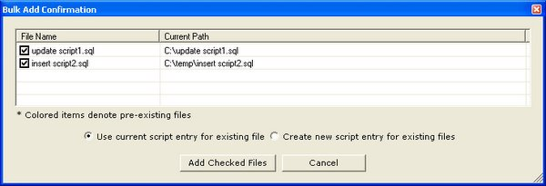]

### Bulk Add From Text File

Very similar to the Bulk Add From List option. Instead of typing or
pasting in a list of files in the screen, this option will pull the list
from a text file for you. Just format the file with one file name per
line. You will get the same confirmation screen as above with the same
options, and then be presented with the [script
configuration](#_Script_Configuration:_Setting) screen

 

## Changing SQL Server Connection


When you started the application, you needed to
connect to an instance of SQL Server. You can change your active
connection after the tool has started as well. There are 2 ways to
accomplish this:

### Change SQL Server Menu Option

The first is from the Action menu 'Change Sql Server Connection" menu
option. This will display the same connection window you saw when the
application started. It will again enumerate the SQL Servers that are
broadcasting on your network, but you can also type in the server name
if you'd prefer or if your server isn't broadcasting or select from you
registered servers list.


###  Recent Servers list

Another option is the "quick change" selection in the "Recent Servers"
dropdown. This list is populated with the last 10 servers that you have
connected to and by simply changing your current selection; you will
change the target server. In both this case and the Action menu option,
the new server name will display in the header section.


 
## Running Your SQL Builds

###  Run Time Build Settings

At run time, there are several settings you can use to change how the
build file is executed against the server.

**Build Type**\
 There are essential 3 different ways to run the project against the
server: Trial, Full/Commit and Partial

**Trial**\
 In trial mode, the build project will be executed, but when
complete, *it will roll back the entire project*. This allows you to
test against a server in advance to make sure that all of your scripts
will execute properly. The settings that will run a trial
are: Trial and Trial - Partial.

**Full/Commit**\
 This is the setting to use when you want the package to commit its
changes to the server upon successful completion. (Of course, if any
script fails, the tool will automatically roll back the changes - after
all, that is the point of the tool :-). The settings that will perform
the commit are: Development Integration, Quality Assurance, User
Acceptance, Staging, Production, Partial and Other. The only difference
is actually just the label that gets applied to the log that you can use
as per your processed.

**Partial**\
 This setting, generally the least commonly used, works in conjunction
with the "Partial Run Start Index" text box. This allows you to specify
a starting mid-point,but run index, of the scripts to run. The settings
for this are: Trial - Partial (will roll back upon completion) and
Partial (will commit upon completion)

**Target Database Override**\
 There may be times during your development cycle, where you will want
to temporarily change the target database for a script (for instance if
your development environment has various versions of the database with
different names (AdventureWorks vs AdventureWorks \_Copy for instance).
This drop down, when set, will use the override value for the build
execution. Whenever the tool encounters a script that is configured for
a default target that has an override set, it will use the override
instead.

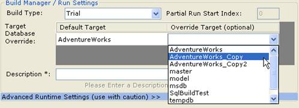

**Description**\
 Before you start a build execution, you will need to enter a
description. This is used as a brief explanation of why you are updating
the database and is kept in the log. Once some text is entered, build
link becomes active, as "Start Build on "(server name")

 

Executing your build project
----------------------------

Now that you've added your scripts, configured
them how do you actually execute your
scripts? You're only a few quick steps away...

### Executing the full project

#### Confirming target SQL Server

Before you kick off your scripts, check to make sure you're running them
where you want. You can verify the server you're currently connected to
via the header section; both next to the Server label as well as in the
Recent Servers dropdown box (this drop down is a quick way to switch
your connection-to another server)


#### Set Run Parameters

Set your run parameters accordingly (see [here ](#_Run_Time_Build)for
full details), including the build type, the target database overrides
(if applicable) and a build description (this becomes part of
the log). Once
these are set, the disabled "Please Enter a Description" link will
change to "Start Build {Server Name}" and become active. Click this and
your off and running!

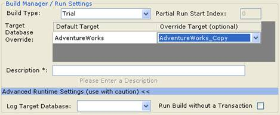

#### Advanced Runtime Settings: Log Target Database and Run Build without a Transaction

By default the Advanced Runtime Settings section is hidden. This is
because generally, you don-->t want o use them. However, if you need to,
they are there.

**Log Target Database:-->**By default, Sql Build Manager logs the
execution to a SqlBuild\_Logging table in the target database. However,
if you need it to log to a different database for some reason, use this
drop down selector to pick that database (note: it needs to on the same
server instance). This does limit the tool-->s ability to determine the
script-->s run status.

**Run Build without a Transaction:**One of the key features of Sql Build
Manager is that it runs the build in a single transaction and if there
is any failure all of the scripts are rolled-back, leaving the database
in a pristine state. You can turn off this protection with this
checkbox. User beware however, because now you-->re just running scripts
individually and if there is a failure, all scripts that run before it
are still committed.

#### Running / Seeing the progress

Once you click the link to start the build, several things happen:

-   The current status in the bottom status panel changes to "Proceeding
    with Build"
-   The Build Results list is populated as the scripts are run,
    verifying the run order, the target database it was executed against
    and its status.
-   A "Cancel" button becomes visible. Clicking this will, of course,
    cancel the build execution and roll back any changes made


Once the build completes, either successfully or with an error, the
final status of the build is shown in the status panel. The example
below shows a script failure, which highlights in red and the status as
"Build Failed and Rolled Back". To determine the failure, or see the
results of any script that ran, you can right-click on that item in the
Build Results list and select "Display Results". The pop-up window will
display the SQL Server message and any errors.


### Executing select scripts

If you don't want or need to execute the full build project from start
to finish, you don't have to. From the build scripts list, you can
select one or more scripts and Right-Click to display the menu. Two
options are "Try Script against Database (Rollback)" and "Run Script
against Database (Commit)". These do exactly what you'd expect them to
do. Note that they will use any Override Target setting you may have set
in the "Build Manager" section.


Just like a full build, you will get the status update in the "Build
Results" section and the final status in the status bar.

## Build Log Information


*Sql Build Manager *keeps both an internal (resident in the project
file) and external (resident in a logging table on the target database)
logs of build runs. Their contents and uses differ significantly. .

### Build History

The internal logging is called "Build History". This records the
information about a build run:

- Start and end time
- Server run against
- Description entered by the user
- Build type
- Final status (committed, rolled back)
- User id of the person that executed the run

 


In addition, it captures details about each script that was run. The
three most useful data points collected are:

-   *Results* - the text response from SQL Server from the execution of
    the script. This is especially useful when there is an error in the
    script to help you pin-point it. To view the results in a bigger
    window, select the script line and right-click to
-   *Success* - an indicator as to whether or not the script ran
    successfully
-   *File Hash* - a SHA1 hash of the script run. This can be used to
    detect file changes.

#### Saving build history to external file.

If you need to save off the build history for a build or a series of
builds, you can do that too. While you are in the build history window
above, simply select one or more rows and right-click. Then simply
select the menu option "Save Build Details for Selected Rows". You will
be presented with a Save File dialog so you can save off the detail.
This detail is saved in an XML format so you can read it and also easily
parse it if you need to.

*Note*: unlike the "Archive Build History" menu option on the main
screen's "Logging" menu, this option does not remove the build history
that is stored in the Sql Build Manager project file - instead it saves
off a copy.

### Database Logging

*Sql Build Manager *logs all committed transactions to a table in the
target database called SqlBuild\_Logging. This allows the application to
set the appropriate indicator icon in the script list and also allows
the application to be able to reconstruct a build project file from
database records (via the Tools --> Rebuild Previously Committed Build
File menu option). This log is much more detailed that the build history
and includes:

-   Script Name
-   *Script ID* (unique identifier for the script)
-   *Script File Hash* - a means to detect changes between runs
-   *Commit Date*
-   *Script Text* - allows for rebuilding of the script if needed
-   *Plus more...*

### Build File SQL Logging

A final option for logging is the creation of a SQL log - a file that
contains all of the scripts included in a build, in the order that they
were run (including use statements for their target database) as well as
comments noting the source of the script. This log is formatted such
that it is a fully executable SQL script and can be run independently
from any SQL query window.

By default, this is turned off, but it can be set via the "Action
-->Setting --> Create SQL log of Build Runs". These logs can be retrieved
via "s" menu.

**Caution!** Having this set all the time can cause your build file to
bloat quickly and unfortunately can slow the general processing of the
file. However, it can be useful is used judiciously.

## Validating a Build Package


Often, you will need to turn-over your build package to another group
for implementation. In doing so, you want to make sure that the package
you turned over doesn't get changed or mixed up with another one. Since
the SBM file changes after each execution (the history is saved), the
file hash of the SBM file is an unreliable signature. To solve this
problem, you can use a hash calculated off the scripts themselves. You
do this by loading up your build package, then selecting Tools -->
Calculate Script Package Hash Signature menu option.

This will open up the Hash Signature window with the calculated SHA1
hash of all the script files together. You can use the Copy button to
grab the hash value for publishing. The hash value will not change
unless there is a change (no matter how minor) to the scripts.

-->


Basic Command Line Execution
============================

## Command Line Arguments 

Sql Build Manager can be run directly via command line or through the
SqlBuildManager.Console.exe helper application. The advantage of using
the "console" application is that you will be able to record exit code
values as well as stream the standard output and error text into any
automation or scheduling software that you may be using.

### [Command line details](commandline.md)


## Command Line Examples 

**Run standard unattended Sql build****\
**Runs the specified .sbm build file on the designated server using the
parameters and target databases defined in the project. The command line
execution uses Windows authentication of the executing process to
connect to the server and database(s). As with in interactive execution,
the results are saved in the .sbm file for review.

-   SqlBuildManager.Console.exe /Action=Build /PackageName=".sbm file name"
    /server=myserver 

```
SqlBuildManager.Console.exe /Action=Build /PackageName="ProjectUpdate.sbm" /server=ProdServer 
```

**Run an unattended Sql build with manual database override
settings**\
Runs the specified .sbm build file on the designated server using the
override database settings defined in the command line arguments. This
is the same as using the Target Database Override setting in the UI.
The command line execution uses Windows authentication of the executing
process to connect to the server and database(s). As with in interactive
execution, the results are saved in the .sbm file for review.

-   SqlBuildManager.Console.exe /Action=Build /PackageName=".sbm file name" /server=server
    /override=default,override

```
SqlBuildManager.Console.exe /Action=Build /PackageName="ProjectUpdate.sbm" /server=ProdServer /override=Main,Copy1
```

Note that multiple overrides may be set if the build file contains more
than one default database setting via a semi-colon delimited
list:/override:Main,Copy1;Template,Template2\>

**Run an unattended Sql build with saved Multi Db configuration**\
Runs the specified .sbm build file using a pre-configured multiple
server/database configuration. The command line execution uses Windows
authentication of the executing process to connect to the server and
database(s). As with in interactive execution, the results are saved in
the .sbm file for review.

```
 SqlBuildManager.Console.exe /Action=Build /PackageName="ProjectUpdate.sbm" /override="prod release.multiDb"
 ```

**Script databases using an Auto Script configuration**\
Uses Sql Build Manager's database scripting feature to script the
designated server/database objects to a target folder.

```
SqlBuildManager.Console.exe /auto "script dev databases.sqlauto"
```
**Running a Stored Procedure Test configuration set**\
Utilizes Sql Build Manager's ability to perform unit tests against stored procedures and
saves the results in a parseable XML data format.

```
SqlBuildManager.Console.exe /test="testing.sptest" /server=Production /database=myDb /log="C:\\logfile.xml"
```
**Opening an interactive Build Manager Session****\
**Opens the selected .sbm build project file in a user window

-   " Sql Build Manager.exe" ".sbm file name"

See [Advanced Command Line Execution](#Advanced-Command-Line-Execution) for
return codes.

Targeting Multiple Servers and Databases
========================================

NOTE: For more advanced multiple target database deployment, also see
[Remote Service Execution and
Deployment](#RemoteServicsExecutionandDeployment)

Configuring Multiple Database Targets
-------------------------------------

To execute commands across multiple databases at once, you will need to
configure which databases you want to target. There are multiple ways to
configure these targets and the default sequence of execution. For each
however, you open up the -->Multiple Database Run Configuration--> window
via the Sql Build Manager window, Action --> Configure Multi
Server/Database Run menu option

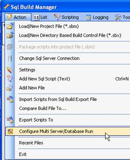

The default window opened when opening the Multiple Database Run
Configuration window will have a single main tab for the server that
your main window is connected to. It will have a sub-tab for each
database that you have configured in the open Sql Build File (.sbm or
.sbx) that you have open.

Configurations can be saved via the Action--> Save Configuration menu of
the Multiple Database Run Configuration window. These are saved as
.multiDb files

Pre-defined configurations can be loaded from the Action --> Load
Configuration menu of the Multiple Database Run Configuration window or
via the Recent Files menu if available.

### Manual Sequence Assignment

1.       Manual assignment consists of typing in the sequence of
execution for target databases in the boxes provided. These will be the
database names that are used for the override target of the sub-tab
named database if you are configuring a multi-database build or will
define the target databases for a report generation.


2.       If you need to add additional server targets, you can use the
Action --> Add Another Server Configuration menu option and use the
connection window to add that server and its database list to the top
level tabs. You would then configure the target database for this server
also by manually typing in the sequence number.


3.       To remove a server configuration that you don-->t need, make sure
that its tab is selected, then click the Remove button on that
configuration

 

### Auto sequence like-named databases

To aid in the assignment of database targets, you can auto fill the
sequence textbox for databases that have similar names.

1.       In the server configuration tab, right-click on a database name
to display the context menu and select the Auto Sequence Target
Databases option


2.       The auto sequence pop-up window will display. In this window,
highlight the portion of the database name that is common to all those
that you want to sequence. You can also set the starting sequence number
and the increment for sequencing in this box. Once you have this
configured, click the OK button and all of the databases that match the
common pattern in their name will be sequenced accordingly.


### Create Configuration via a Query

If your target database list is available via a SQL query, you can use
that query to generate a multi-database configuration file at run time.

1.       From the Multiple Database Run Configuration window select the
Load Configuration via Query.


2.       In this window, you can type in the query that you will use to
retrieve your database list. The query must return 3 columns worth of
data in order (the column names are unimportant):\
 Server Name: The server that the target database can be found on. This
is needed even if the target database is on the same server as the
default database. \
 Default DB Name: the default database that is configured in the
-->Database Name--> column of the Build Scripts window. \
 Override DB Name: This is the name of the target database that you
actually want to execute against

3.       If you want to add additional data from this source that will
appear in an [Adhoc query](#RunningAdhocQueriesagainstmultiple), you can
put in additional columns after the \<\<override Db Name\>\> entry and
these values will carry over into the Adhoc query results

4.       You can also load an existing query setting (.multiDbQ file)
via the Action --> Open Saved Query Configuration or Recent Files menu
options.

5.       You can change the source database (the database this
configuration query will be executed against) via the dropdown list.

6.       You can change the source server (the server where the source
database resides) via the Action --> Change Sql Server Connection menu
option.

7.       Click -->Create Configuration--> button to generate the
configuration file. You will then be prompted to save the query as a
.multiDbQ file (optional). The query window will close and the newly
generated configuration setting will be loaded in the Multiple Database
Run Configuration window.

 
-

Threaded Multi-Server Database Execution
----------------------------------------

Do you need a fast, multi-threaded execution of your scripts across a
large number of databases? The threaded option is right for you. With a
few command line settings, you can set up your *Sql Build
Manager* project to get executed across hundreds, even thousands of
databases in a parallel threaded fashion.

*NOTE*: While this type of execution still manages transactions per each
SBM file execution, it does not manage all of the transactions together
like when run in a serial mode. If the scripts run on one database are
successful, they will be committed, even though the scripts for another
database may fail and be rolled back. 

### Set-up

There are two options for configuring your multi-database execution. If
you know all of you target databases ahead of time and want to set them
up manually, you can go through the UI to create the configuration. If
you need another tool to create the list or want to construct a
configuration manually, you can use a simplified, delimited version of
the configuration, one setting per line:

\<server\>:\<default database\>,\<target
database;\<default2\>,\<override2\>

-   The first argument is the server name, followed by a colon (:).
-   Next it the first default database, override database configuration
    setting, using a comma (,) as the delimiter. (Remember, the default
    database is the database set in the SBM for the script. The override
    database is the actual database you want to execute against at run
    time.
-   If you have additional default databases set in the SBM file, you
    will need another override setting. Separate these pairs by a
    semi-colon (;).

For each database you want to execute against, add an additional line in
the configuration file (i.e. each line equates to an additional thread).
Finally, save the file with a .cfg extension

See [Advanced Command Line Execution](#AdvancedCommandLineExecution) for
the command line syntax to execute your threaded builds.

Remote Service Execution and Deployment
=======================================

While the tool has the feature for [Targeting Multiple Servers and
Databases](#TargetingMultipleServersandDatabases), you can take that
multi-target, multi-threaded execution one step further and distribute
that load across multiple -->Execution Servers--> as well. It builds on the
multiple server functionality and extends it to send build requests via
a remote service call to remote computers that will handle the actual
processing of the SQL scripts. You can spit the load amongst all of your
execution servers for maximum efficiency and minimum deployment time.

Overview
--------

To access the Remote Execution Service form, click the Action --> Remote
Execution Service menu item. (If this menu item is not enabled, you will
need to have your [user id configured](#FeatureAccessSettings) by your
administrator to get access)


The remote execution form has 4 sections:

- [*Remote Servers*](#RemoteServers) --> this is for the list of
remote execution servers that you will be using. You can either type
into the list or use the Action --> Manager Server Sets menu option to set
up and load pre-configured server groups. NOTE: an execution server is
not necessarily a SQL Server machine. It can be any computer or server
that has the remote execution service loaded and has connectivity to all
of your target SQL servers.

- [*Execution Settings*](#ExecutionSettings) --> this is the same
as the execution settings group found on [Command Line
Builder](#AutoCreationofCommandLineStatements) form. This will configure
which SBM package you will use, the logging path, execution parameters
and the multi-database configuration that will be used.

- [*Workload Distribution*](#WorkloadDistribution) --> sets how
you would like to distribute the workload across your execution servers.
The default value is -->Equally Distribute-->--> which will do just that.

- [*Remote Service Status
Dashboard*](#RemoteServiceStatusDashboard)**--> gives you a view of the
status of the Sql Build Manager Build Service on each of the execution
servers.


### Section Detail

#### Remote Servers

This list of remote servers that will serve as the execution engine for
your deployment can be populated in 2 ways. First, you can type in the
machine name of the servers directly into the grid. However, if you plan
on re-using server sets, you are better of creating Server Sets via the
Action --> Manager Server Sets, menu item which will display the Remote
Execution Server Configuration window.

-->

The first step in creating a reusable configuration is to use the Action
--> New Configuration menu. You will be prompted for a Server Group name,
pick one that makes sense for the group of execution servers that you
will be first setting up and click -->OK-->. This name will show up in the
left side -->Server Group--> section. Click on the name to activate the
right hand side setting section.

In the -->Server Group Description--> section, give yourself a meaningful
name --> for instance -->Development Area execution servers-->. Next, add the
servers to the Remote Execution Server grid by typing in the bottom text
box of the grid. Once you have finished that group, you can add another
Server Group (a--> -->Production--> group for instance) and add the servers
for that set or you can use the Action --> Save menu item to save the
configuration file. NOTE: the next time you open this page, it will
automatically load the last configuration you used.

Once you have your groups configured, to use one of them, select it-->s
name in the Server Group list and click the -->Use Selected Group--> button.
This will close the form and add the server names to the Remote
Execution Server grid on the parent page.

#### Execution Settings

For a description of the common settings between this form and the
Command Line Builder form, see that
[section](#CommandLineBuilderOptions). There are a couple of important
differences:

- *Root logging path* --> this path must be present and accessible
on each execution server. It is best to use a local folder path on the
execution server (vs. a network share) to maximize performance and
reliability of the logging and execution.

- *Override Target Settings / Configuration links* ---> the 2
links -->Open Multi-Db config form--> and -->Create configuration via query-->
allow you to create and/or preview the multi-database deployment
configuration. Just like the command line, this can be done via a
pre-configured file ([.multiDb](#TargetingMultipleServersandDatabases) -->
which is an XML formatted configuration file or .cfg which is a plain
text delimited file) or via a [.multiDbQ](#CreateConfigurationviaaQuery)
--> which is a formatted database query that can dynamically construct the
configuration for you. These links will open the appropriate
configuration page. By saving the new configuration file and closing out
the form, the configuration file name will populate in the Override
Target Settings text box.

- *Derive Remote Execution Server list from Override Target
Settings*--> this is an option you can use if your target database servers
also act as your remote execution servers. By checking this box, you
direct the tool to derive the list of unique server names from the
Override Target Settings file or query and then use this list as the
Remote Execution Servers list. NOTE: checking this box will
automatically change the [Workload Distribution](#WorkloadDistribution)
to *Each execution server handles only its local load (matches host
names).*You can change the selection if you-->d prefer however.

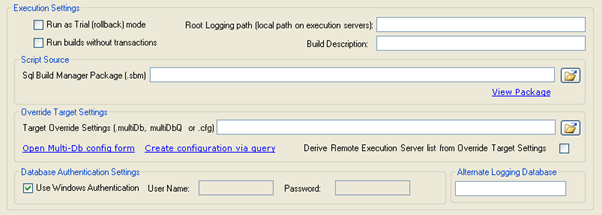

#### Workload Distribution

To take advantage of the multiple execution servers, you need to
distribute the load to each of them, further distributing the processing
of the SQL scripts. This can be managed in 2 ways:

- *Equally distribute load across execution servers* --> simple
enough. It will take the load, split it as equally as possible across
all of the servers. The split is done by chunking out into approximately
equal parts.

- *Each execution server handles only its local load (matches
host names) -->*this option should only be used if you double task your
server not only as a SQL Server host, but also a remote execution host.
This will tell the distributor to do a match between the execution
server name and the server name of the target database. It will only
task the execution server with positive matches.


Because work is being distributed and/or matched to execution servers,
there is the potential that the workload could be unbalanced and/or
database could be missed altogether. To give the user insight into this,
once a SBM build file and Override Target Setting values have been
provided, the -->Preview Distribution--> button becomes enabled. This will
have the tool do a dry run at splitting up the workload and display for
you how it will be managed as well as any databases that will be skipped
and execution servers that would be un-tasked.


#### Remote Service Status Dashboard

This report the status of the execution servers you have configured in
the [Remote Servers](#RemoteServers) section. It is populated by
clicking the -->Check Service Status--> button.

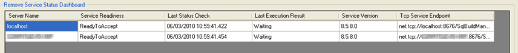

The 6 status columns are:

- Server Name --> you guessed it, the name of the execution
server.

- Service Readiness --> tells you the status of the service on
that machine. The possible values are:

- ReadyToAccept --> the service is at your beckon call and ready to go.

- PackageAccepted --> you have submitted a package and it is undergoing
setup.

- PackageValidationError--> - there is something wrong with the package
and it could not be processed

- Processing --> hmm. Yes, it-->s doing your work for you

- Error --> something bad has happened.

- Unknown --> the service isn-->t properly reporting a status.

- Unreachable --> the service can-->t be contacted --> is the service
running?

- ProcessingCompleted --> the job is done and the processor is
completing it-->s clean-up

- Last Status Check --> the last time the client attempted to
contact the service for a status update

- Last Execution Result --> since the remote service has been
started, what was the result of the last execution. If nothing has been
run since the service start, it will report -->Waiting-->. Otherwise you
will most often see:

- Successful --> self explanatory

- FinishingWithErrors --> the processing completed, some databases were
probably updated, but some have experienced a problem. You can check
which ones via the [service status context
menu](#ServiceStatusContextMenu).

- Service Version --> just to make sure you-->re services are all in
sync, this is the program version of each execution service.

- Tcp Service Endpoint --> the Sql Build manager talks to the
remote execution servers via a TCP connection. This tells you what the
URL and communication port are for the service. This is used mostly for
troubleshooting.

#### Service Status Context Menu

To view the details of the last execution, you can right click on a cell
in the [Remote Service Status Dashboard](#RemoteServiceStatusDashboard)
to pull up the context menu. In this menu you have five options:


- View Last Execution -->Errors--> log --> this will display the error
log from the selected row-->s target server. This log displays the list of
servers for which execution was not successful.


- View Last Execution -->Commits--> log --> this will display the
commits log from the selected row-->s execution server. This log displays
the list of servers for which execution was successful.

- Paste Server/Database value below to retrieve detailed log for
last run --> this is a very long winded label, but you get the idea. You
can take the target database/server from the errors or commits log
(pixilated above for your protection), paste it in here and the
execution service will send back the detailed execution log specifically
for that database. In that log, you should see exactly what happened
with the run.

- View Remote Service Executable Log file --> the remote service
agent keeps a running log of errors and warnings that may be useful to
determine what caused an issue with an execution --> especially if the
error is not SQL related. This menu item will pull the contents of that
log file into a display window for you, so you don-->t need to login to
that machine directly

- View Build Request History for this Remote Service --> as of
version 8.5.8, the agents will keep a history of accepted build
requests. This menu item will display information about these requests.
From this new window, you will also be able to use the context menu to
pull back the log files for each specific execution.


## Pre-testing database connectivity


Once you have added or loaded your list of [Remote Execution
Servers](#RemoteServers) and also set your Override Target Settings
value, the application has enough information to be able to pre-test the
remote execution server-->s agent ability to connect to its designated
database targets. This pre-test is not required, but may highlight
connectivity issues prior to you actually executing a full build.-->

To execute the test, just click the -->Test Connections--> button and the
application will instruct the remote execution servers to make a
connection (don-->t worry, no scripts will be run). If all connections as
successful, you will get a simple pop-up message confirming this. If
there are connection issues, you will get a pop-up listing the remote
execution server name, the SQL Server name and the database name where
the connection could not be made.


## Performing a remote execution


Below is a step-by-step how-to for running a remote execution and
deployment. For details about each section and its function see above in
the Remote Execution and Deployment
[overview](#RemoteServiceExecutionandDeploymentOvr) and [section
detail](#RemoteServiceExecutionandDeploymentSect)

1.       Open the Remote Execution Service From

2.       Type in or [load list](#RemoteServers) or Remote Execution
Servers that you will be tasking with your deployment.

3.       Click the -->Check Service Status--> button. This will have the Sql
Build Manager call out to the specified servers and see if they-->re ready
to go.

4.       Type in your Root Logging Path --> remembering that this is going
to be a local path that will reside on each execution server. You can
use System Environment variables in the path to make is more
customizable.

5.       Type in a Build Description --> a -->serial number--> or description
of why you-->re performing the build

6.       Select a Script Source --> your SMB build package. You can either
type in the path or use the -->Open--> button to navigate to it.

7.       Select an Override Target Settings value --> your pre-defined
.multiDb, .multiDbQ or .cfg file. You can also create a new one with
either the -->Open Multi-Db config form--> or -->Create configuration via
query--> link buttons.

8.       Optionally, you can change your authentication settings and the
Alternate Logging Database values.

9.       Next, select your workload distribution so tell the tool how
you want to spread the work across your servers.

10.   Optionally, but a good idea, click the -->Preview Distribution-->
button. This will display the -->Calculated Execution Distribution--> form
so you can ensure that all servers and databases will be tasked and
updated.

11.   Finally, click the -->Submit Build Request--> button. This will send
the distributed load to the execution servers for work. While processing
is going, Sql Build Manager will automatically query each of the
execution servers 2 times a second to update the Service Readiness and
Last Execution Result values.

12.   Once all services report back a status of -->ReadyToAccept-->, the
auto polling will stop.

13.   If any of the execution servers reports a -->FinishingWithErrors-->,
you should check the results via the -->View Execution -->Errors--> Log--> and
the detailed log results to see how you can mediate and correct the
problems.

For a command line execution across multiple servers, see the _Advanced
Command Line Execution_ below

Advanced Command Line Execution
===============================

Execution Flags
---------------

To run your multithreaded build or remote server execution, you need to
use the SqlBuildManager.Console.exe utility with the command line
options:

-   /Action=Threaded This is the key flag to alert the utility that you
    will be executing this SBM file in a multi-threaded mode. This flag
    is used exclusively for the threaded mode.
-   /build="\<.sbm file name\>" \
     Lets the tool know that you want to run a Sql Build using the
    specified .sbm file. This is not used alone, but in conjunction with
    a /server and/or a /override argument.
-   /ScriptSrcDir="\<directory path\>"\
     Alternatively, if you want to run your scripts from a directory
    instead of a pre-constructed SBM file, you can use this option. Set
    the value to the directory where your scripts are located. The
    engine will look for all files with a .sql extension and sort them
    by file name. They will be configured to leave transactions with
    full rollback on failure. If this and a /build tag are found, this
    will be used. Also, since the files will be added without a default
    database setting, the engine will use the first override database
    setting per line in the config file
-   /override="\<.multiDb file name\>" or /override="\<.cfg file
    name\>"\
     Sets the pre-configured multi database/server configuration or the
    text delimited configuration to be used along with the .sbm file for
    the build run.
-   /RootLoggingPath="\<directory name\>" Sets the root directory under
    which all of the log files and folders will be placed. This flag is
    used exclusively for the threaded mode. Note that you may use
    environment variables in this path to make value more dynamic per
    system.
-   /trial=\<true or false\> By default, the threaded execution will
    commit the changes to the target databases. If you want to
    experiment with the run to check how it will go, you can set the
    trial tag to true. This will work the same as the trial mode in the
    UI and roll back the changes in each database, even upon successful
    completion. To keep things more simple, the successful runs are
    still added to the Commits log file but are recorded as "Build
    Successful. Trial Rolled-back"
-   /LogAsText=\<true or false\>. Be default, the value is false, which
    will create the Commits and Errors log files in HTML. The advantage
    of this is that it will hyperlink you to the appropriate folder for
    viewing error or execution log details. If you set the value to
    true, the same information will be written, just in plain text.
-   /username="\<user name\>" The user name for a SQL Server user
    account that you want to execute under. If this tag is present, then
    a /password tag is also required. If these tags are not present, the
    tool will use Windows authentication when connecting to the
    database.
-   /password="\<password\>" The password for the SQL Server user
    account that you want to execute under. If this tag is present, then
    a /username tag is also required. If these tags are not present, the
    tool will use Windows authentication when connecting to the
    database.
-   /LogToDatabaseName="\<alternate database\>" Allows you to write the
    commit logs to the SqlBuild\_Logging table on a different database
    than the target databases. This should be used sparingly as it will
    not give you the proper script status when opened in the user
    interface
-   /description="\<run description\>" Allows you to add a custom
    description to the run. This will be used in the same fashion as a
    description added during a serial/manual run. This will also be used
    as the token replacement for any dynamic scripts you have. The token
    for this value is \#BuildDescription\#
-   /Transactional=\<true or false\> Allows you to run the scripts
    without transactional protection. WARNING! Using this setting will
    mean that if a script fails, all previous scripts will still be
    committed and your databases will be left in an inconsistent state
-   /TimeoutRetryCount=\<positive integer number value\> Sets the
    ability to have the package be automatically re-run -->x--> number of
    times if the SQL Server exception encountered is -->Timeout expired-->.
    This is not valid in combination of /Transactional=false

The following keys are used exclusively for [Remote Server
Execution](#RemoteServiceExecutionandDeploymentOvr). See this section
above for the UI version and explanation of this functionality. Unless
noted, the above [Execution Flags](#Execution) can also be used to
configure the run. -->For ease of use and to help you create a properly
formed command-line string, there is now a -->Create Command Line--> button
available --> but be aware that while this does create a well formed
string it does NOT validate the values or files and therefore does not
guarantee execution success.


-   /remote=true This is the key flag to alert the utility that you will
    be distributing execution to remote execution servers. This key
    should *not* be combined with the /threaded flag.
-   /RemoteServers=-->\<remote server file\>--> This defines the file to use
    that defines the remote execution servers that will be used for this
    run. This file should be a simple text file that contains one
    machine name per line.
-   /RemoteServers=-->derive--> This is an advanced setting that you can use
    if your target database servers also act as your remote execution
    servers. This instructs the tool to derive the unique server names
    from the /override settings and use that list as the remote server
    list.
-   /DistributionType=equal or /DistributionType=local Defines how the
    load for the execution will be split across the execution servers.
    For details, see the [Workload Distribution](#WorkloadDistribution)
    section.

Logging
-------

Since there isn't a user interface for this type of execution, logging
is obviously important. For general logging, the
SqlBuildManager.Console.exe has its own local messages. This log file is
named SqlBuildManager.Console.log and can be found in the same folder as
the executable. This file will be the first place to check for general
execution errors or problems.

To accommodate the logging of the actual build, all of the output is
saved to files and folders under the path specified in
the /RootLoggingPath flag. For a simple threaded execution, this is a
single root folder. For a remote server execution, this folder is
created for each execution server.

**Working folder**

This folder is where the contents of the .SBM file are extracted. This
file is extracted only once and loaded into memory for the duration of
the run to efficiently use memory.

**Commits.html (or .log for text scripting)**

Contains a list of all databases that the build was committed on. This
is a quick reference for each location that had a successful execution.

**Errors.log (or .log for text scripting)**

Contains a list of all databases that the build failed on and was rolled
back. This is a quick reference for all locations that had failures.

**Server/Database folders**

For each server/database combination that was executed, a folder
structure is created for each server and a subfolder in those for each
database. Inside each database level folder will be three files:

-->  LogFile-\<date,time\>.log: This is the script execution log for the
database. It contains the actual SQL scripts that were executed as well
as the return results of the execution. This file is formatted as a SQL
script itself and can be used manually if need-be.

-->  SqlSyncBuildHistory.xml: the XML file showing run time meta-data
details on each script file as executed including run time, file hash,
run order and results.

-->  SqlSyncBuildProject.xml: the XML file showing the design time
meta-data on each script file that defined the run settings, script
creation user ID's and the committed script record and hash for each.

Command Line Return Codes
-------------------------

 

### Execution Result codes

These are the codes that may be returned by the
SqlBuldManager.Console.exe file to the originating command. Any non-zero
result is an error.

- 0--> - Successful execution

- 1 --> The execution finished however there was an error on one
or more target databases. You should check the errors.log file for
details.

- -99--> - The /RootLoggingPath flag is missing. This is required
for threaded and remote server executions.

- -100 --> The /override flag is missing

- -101 --> The /build flag is missing. This is required to define
the .SBM file that is to be executed.

- -102 --> The /override flag has an incorrect value

- -103 --> The .SBM file was invalid. -->The application was not
able to load the .SBM file

- -104 --> The MultiDb configuration file was invalid. The
application was not able to load the .MultiDb, .MultiDbQ or .cfg file

- -105 --> A /ScriptSrc flag was found, but the specified path was
not found.

- -106 --> The .SBM file defined in the /build flag was not found

- -107 --> An invalid /transactional and /trial flag combination
was found. A run cannot be /trial=true and /transactional=false

- -108 --> Upon loading the multi-database configuration, a
missing default value or target override setting was found. This needs
to be corrected for the scripts to run.

- -109 --> Negative /TimeoutRetryCount -->value. This flag must be
set to a positive integer balue

- -110 --> -->An invalid /transactional and /TimeoutRetryCount -->flag
combination was found. A run cannot be set with
/TimeoutRetryCount=(anything \>0) and /transactional=false

- -200 --> The .SBM file scripts were not extracted properly.

- -201 - The .SBM file was not in the proper format. The data
was not loaded

- -300 --> Run initialization error. Unable to configure runtime
data

- -301 --> Build processing error. A particular execution thread
encountered an error. Check the errors.log file for details.

Remote server execution specific error codes

- -600 --> Unable to create a Build Settings object from specified
command line arguments

- -601 --> One or more of the remote execution servers encountered
an error in execution

- -700 --> The /RemoteServers flag is missing

- -701 --> -->-->The /RemoteServers flag is invalid. This must refer
to an existing file.

- -702 --> The /DistributionType flag is missing.

- -703 --> The /DistributionType flag value is invalid.

- -750 --> One or more of the specified remote execution servers
did not return a -->Ready to Accept--> status message

- -751 --> Unable to connect to one or more of the specified
remote execution servers.

- -752 --> No remote execution servers were specified


Advanced Script Handling
========================

Utility Scripts
---------------

To assist you in creating robust, re-runable scripts, Sql Build Manager
comes with an array of -->utility scripts--> that will allow you to insert
commonly used, customized script snippets into your script file. For
instance, let-->s say you need to write a script to add to a column to a
table. What is the best way to write that script? Sql Build Manager
knows!

### Utility Script Example

1.       Right click on the Build Script list and select -->Add New Sql
Script (Text)--> menu item (you can also use the Ctrl+N hot key)


2.       The -->Add Sql Script Text--> window will pop up. In this window,
right click in the main script window to pull up the utility script
context menu. Since we-->re adding a column, pick the -->Columns--> menu, then
the -->Add Column--> option.


3.       The Utility Script Replacements window will display. Since we
picked Add Column, the fields required to define a new column. The
scratch pad area is the contents of your clipboard. This can be handy if
you have some snippet you want easy access to. Next, fill in the column
definition for the required fields. As a short cut, you can highlight
text in your scratchpad area and press the function key associated with
the textbox you want to fill.


4.       Once you have filled in your definition, click the Submit
button. This will close the Utility Scripts Replacements window and
insert the newly created script into the body of the Add SQL Script
Window.--> A couple of notable features are added. First, a default name
was added to the script name box. This name is dependent on the type of
action you performed. Here for instance it gives you a name describing
the addition of a column. Also of note the script that was created is
-->wrapped--> in select against the database to see if the column already
exists in the database. This allows you to commit the script multiple
times without worrying about getting an error that the column already
exists


 

### Simple Text Inserts

Some of the utility options don-->t do much other than insert simple,
commonly used pieces of SQL.

- **WITH NOCHECK ADD --> (string literal)** : this does just that,
adds the text WITH NOCHECK ADD at the location of your cursor. Handy
when working with Foreign Keys.

- **WITH (NOLOCK) --> (string literal)** : adds the text WITH
(NOLOCK) at the location of your cursor. Handy when working with scripts
that have selects against tables that can afford the potential for a
-->dirty read-->

- **Insert Comment Header:**adds a comment header block to your
script at the location of your cursor. Great for ensuring consistency in
your procedure and function definitions.


- **Grant Database Permissions:**Adds a rather large script to
iterate through your target database and grant permissions to all of
your stored procedures and functions to a specified list of user groups.

### Token Replacements

A canned search and replace function.

- **CREATE****--> ALTER:**This will search all the text you have
highlighted for the word CREATE (case insensitive) and replace it with
ALTER.


### Script Creation

These utilities will help you create your scripts from scratch. You
don-->t need to know the syntax for any of the scripts, just fill in the
form and the scripts are created for you. The example above in [Utility
Script Example](#_Utility_Script_Example) is a sample of a script
creation utility. The others are found in the sub-menu for their object
type. All of these scripts will contain the -->IF EXISTS--> or -->IF NOT
EXISTS--> wrapping to ensure they are fully re-runable.


- **Columns**

    - Add Column: As above, generates a script to add a column to a table
    - Alter Column: Creates a script to alter a column on a table
    - Delete Column: Creates a script to delete a column from a table
    - Rename Column: Creates a script to rename a column. This is a pretty
    complex one, very useful if you are going to rename

- **Foreign Keys**

    - Drop Single Foreign Key: Creates a script to drop a foreign key from
    a table
    - Drop All Foreign Keys: Creates a script to drop all of the foreign
    keys associated with a table. Another pretty complex script.

- **Default Constraints**

    - Add Default Constraint: Creates a script to add a default value to
    an existing column in an existing table.
    - Drop Default Constraint: Creates a script to drop a default
    constraint on a column. Use this when you know the name of the
    constraint already
    - Drop Column Default Constraint: Creates a script to drop a default
    constraint on a column when you don-->t know the name of the constraint.
    This is useful when you had created a constraint without specifying a
    name and let SQL server name it for you with a random name.

- **Triggers**

    - Drop Trigger: Drops a trigger from the database
    - Disable Trigger: Creates a script to disable an existing--> trigger on
    a database table
    - Enable Trigger: Creates a script to enable an existing trigger on a
    database table

- **Tables**

    - Drop Table: Creates a script to drop a table.

- **Indexes**

    - Add Index: Creates a script to add a standard index (non-unique,
    non-clustered) to a table. Specify a comma delimited list of columns.
    - Add Unique Index: Creates a script to add a unique index to a table.
    Specify a comma delimited list of columns.
    - Add Non-Clustered Index: Creates a script to add a non-clustered
    index to a table. Specify a comma delimited list of columns.
    - Drop Index: Creates a script to drop an existing index

- **Stored Procedures**

    - Drop Stored Procedure: Creates a script to drop a stored procedure
    from the database.
    - Grant Execute to Stored Procedure: Creates a script to grant the
    EXECUTE permission to a specified user to stored procedure
    - Revoke Execute to Stored Procedure: Creates a script to revoke the
    EXECUTE permission to a specified user to stored procedure

- **Functions**

    - Drop Function: Creates a script to drop a function from the
    database.
    - Grant Execute to Function: Creates a script to grant the EXECUTE
    permission to a specified user to function
    - Revoke Execute to Function: Creates a script to revoke the EXECUTE
    permission to a specified user to function


### Script Wrappers

These are utility scripts that will take a script you already have and
put it in an IF EXISTS or IF NOT EXISTS wrapper. These help you create
more robust scripts that perform pre-checks around your change to limit
the number of failures and roll-back changes you have as you run the
scripts across your environments. Like the [script
creation](#_Script_Creation) utility scripts, these are found in the
sub-menu items for the object type.

1.       Add your custom script to the script form. Highlight the script
(or portion of) that you want to be wrapped, then select the appropriate
object wrapper selection

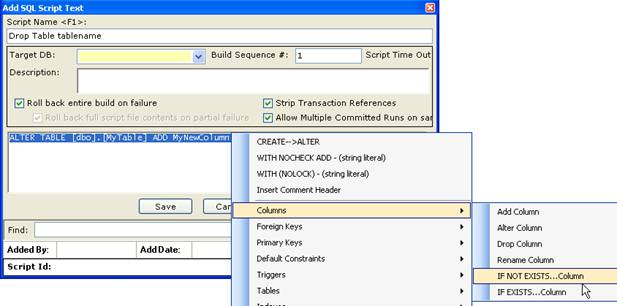

2.       The utility window will open up. Notice that your highlighted
text has been added to the scratchpad. Also notice that the checkbox
-->Insert Scratch Pad Values--> is checked--> - this setting means that the
text in the scratchpad will be inserted inside the--> wrapper. Fill out
the form and click submit.


3.       The utility window will close and your highlighted text with be
overwritten with the--> updated -->wrapped--> script


- **Columns**

    - IF NOT EXISTS-->Column: Puts a wrapper around a script to ensure that
a column doesn-->t exist on a table prior to running the enclosed script.

    - IF EXISTS-->Column: Puts a wrapper around a script to ensure that a
column does exist on a table prior to running the enclosed script.

- **Primary Keys**

    - Wrap Add Primary Key: Checks to make sure a primary key does not
exist before running the enclosed Primary Key add script.

- **Triggers**

    - Wrap Add Trigger:--> Adds a script header to check if a trigger is
pre-existing. If yes, then the trigger is dropped. Your create script is
then added after this wrapper.

- **Tables**

    - Wrap Add Table: Checks to make sure the table you are adding does
not pre-exist in the table. If not, it falls into your add script.

- **Indexes**

    - Wrap Add Index: Checks to make sure an index on a specific table
does not exist prior to running your enclosed script.

    - Wrap Alter Index:--> Checks to make sure an index on a specific table
does exist prior to running your enclosed script.

- **Stored Procedures**

    - Wrap Add/Alter Stored Procedure: Adds a script header to check if
the stored procedure is pre-existing. If yes, then the stored procedure
is dropped. Your script is then added after this wrapper.

- **Functions**

    - Wrap Add/Alter Function: Adds a script header to check if the
function is pre-existing. If yes, then the function is dropped. Your
script is then added after this wrapper.

- **IF EXISTS-->Object**
    - Creates a generic query against
sysobjects to see if the specified object and type exist. If it does, it
will run your enclosed script

- **IF NOT EXISTS-->Object**
    - Creates a generic query against sysobjects to see if the specified object and type exist. If it does not, it will run your enclosed script

 

### Script Manipulation and Optimization

There are several built in routines that will modify your scripts to
perform specific functions.


#### Optimize SELECT : Add -->WITH (NOLOCK)--> Directive

This routine scans through your script (just your selected section or
the entire contents if nothing is selected) and will add a WITH (NOLOCK)
directive to all of your table select scripts. This is a very important
directive to add to your scripts (especially stored procedures and
functions) to improve performance. NOTE: this should only be used when a
dirty read is acceptable: reports and displays for instance, but not on
important transactional selects.

#### Convert to ALTER COLUMN

This will take a simple CREATE TABLE script or selection of column
definitions and modify it to a series of ADD/ALTER column.

1.       Add your CREATE TABLE script to the script window (or just the
column definition sections) and highlight it. Right-Click and select the
-->Convert to ALTER COLUMN--> menu option


2.       The program will run through its processing and produce the
altered script containing an IF EXISTS wrapper to ALTER or ADD the
defined columns.


#### Transform to resync TABLE

This routine will make sure that a table in all of your environments
match the schema of the table you have scripted. The script created will
first make sure that the specified table exists (it not, it will create
it) then perform an ADD or ALTER column script for each column you have
defined. Finally (and this is the part to be very aware of), it will
iterate through the rest of the table schema and DROP any columns that
you didn-->t have defined. This leaves you with the potential for data
loss.

1.       Add your CREATE TABLE script to the script window and highlight
the text. Next, Right-Click and select the -->Transform to resync TABLE-->
menu option.


2.       You will be presented with a warning message, just to make sure
you are aware of the risks and what will be created


3.       Clicking -->Yes--> will process the script and produce the re-sync
results.


 

Script Policy Checking
----------------------

The Sql Build Manager will perform checks against your scripts at you
save them or script them from the database. These are designed to ensure
that you have robust, repeatable scripts that are efficient and
optimized. If a script does not pass one or more policy checks message
box describing the violation will display. The user does have the
ability to ignore the warning and continue on if they choose to do so.


 

### Manual Policy Checking of Build Package

In addition to policy checking when first adding or saving a script in
the Sql Build Manager project, you can also run the policy checks
against the entire contents of the package at once. This is accomplished
via the Tools --> Script Policy Checking menu option


This will present you with the Script Policy Checking window. This
window gives you the list of available policies and a description of
each. Be default, all of the policies are checked, but you can uncheck
any that you don-->t want to run this time. Next, click the -->Execute
Policy Checks--> buttons and the results will appear in the bottom list.
By default, failures are sorted at the top of the list. To correct
violations, you can double click on the script name in this list to open
an edit window.

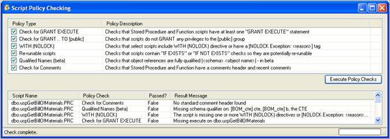

### Grant Execute Policy

This policy checks all of your stored procedures and functions to ensure
that they include at least one GRANT EXECUTE ON \<routine\> TO \<user or
role\> statement at the end. This is designed to ensure that proper
privileges are granted to the routines so that there will not be
permission problems when you deploy them.

### Grant Execute to [public] Policy

Be default, SQL Server has a public role. In most cases where security
is a concern, you don-->t want to use this role, but rather want to create
one that has only the rights that you specify. This policy looks to see
if there is a GRANT EXECUTE ON \<routine\> TO [public] statement in your
script and warns you if there is.

### WITH (NOLOCK) Policy

In order to ensure peak performance of your database and limit the
number of locks and deadlock potential, most SELECT queries can be run
without locks (i.e. by specifying WITH (NOLOCK) for the table). To make
sure you don-->t forget to add these statements, this policy validates
that each table you select against has this directive. Of course, there
will be cases where you need to let the database take a lock, so to
accommodate this, you can instead add a token to your scripts that
provide an exception to the scripts:--> [NOLOCK Exception: \<reason
description\>]. By adding this tag you tell the policy handler that you
have purposely left out NOLOCK directives and so the policy check should
not fail.

### Re-runable Script Policy

A robust script is one that won-->t fail if it-->s run more than once in the
same environment. In other words, it check to see if there is an
unacceptable condition prior to being executed. In SQL, this is usually
accomplished by adding an IF EXISTS or IF NOT EXISTS wrapper or header
to your script. To aid you in doing this, the program provides methods
to create these for you (see [Script Creation](#_Script_Creation) and
[Script Wrappers](#_Script_Wrappers)). If also provides a policy check
to make sure that there is at least one of these checks in your script.
NOTE: This is not a fool-proof guarantee that your scripts are truly
re-runable, but rather a quick check to see if there is a statement
included.

### Qualified Table Names Policy

For improved performance in SQL server, you should make sure that your
objects have their schema qualifier when you reference them.
\<schema\>.\<table\> This may be the standard -->dbo--> qualifier:
dbo.Employee or a custom schema that you have created
HumanResources.Employee. This policy checks to see that your table
references all contain a schema prefix. NOTE: this is in beta as the
algorithm to try to catch all instances is more complex than you-->d
think. This may over-catch or under-catch for some scripts.

### Comment Header Policy

For good record keeping and change auditing, it-->s great to have change
comments in your routines. This policy will check to make sure you have
a fairly standard comment header included in your stored procedure and
function definitions. This policy specifically looks to make sure your
definition contains comments for: Name, Description, Author and Change
History. You can easily fulfill this policy by using the [Simple Text
Inserts](#_Simple_Text_Inserts) -->Insert Comment Header--> utility script.

In addition, this policy check looks for -->recent--> comment additions to
ensure that changes are being appropriate. The threshold is different
depending on how the policies are run. If you are saving an individual
script, creating a script through the [Direct Database Object
Scripting](#_Direct_Database_Object) or updating generated object
scripts via [updating object scripts](#_Updating_Scripted_Objects)
feature, the tool will look for comments created either yesterday or
today. If you are running the policy checks via the Tools --> Script
Policy Checking menu option, it will look for comments created within
the last 40 days. The dates need to be in the mm/dd/yyyy format.

### Stored Procedure Parameter Policy

This is a configurable policy that will enforce that certain parameters
be included in a defined set of stored procedures. The configuration is
set in the [Enterprise / Team Settings](#EnterpriseTeamSettings)
configuration file. You can filter your stored procedures by Schema and
Target database and define the parameter check by parameter name and
parameter data type. If the policy does not find the specified parameter
defined in the signature of a stored procedure that meets the filter
criteria, the script will fail the check.

Direct Database Object Scripting
================================

 

Scripting Database Objects
--------------------------

Without leaving *Sql Build Manager *you can create SQL object scripts
directly from your designated database and add them into your Sql Build
Project. You can do them one at a time, or script an entire class of
database objects all at once! Here's how...

1.       Select a database to be your script source via the Scripting
menu's database drop down list:


2.       Once a database is selected, the next menu item list is
available, where you can select the object type:


3.       Now that you've selected your object type, *Sql Build
Manager*presents you with a list of all objects in the source database
for you to select. You can check one or more. You can also right-click
on any one of them to get a script preview of the object.


4.       Once you've selected your objects for scripting, click the "Add
Files" button and the scripts are created. As a means to confirm the
selections and give you a chance to exclude duplicates, you next see a
confirmation screen. Files that match (by file name) items already in
your build file are colored in orange. To add the checked files into
your build project, click on "Add Checked Files".


5.       Lastly, you need to tell *Sql Build Manager *how to handle
running the files against a target database; you do this via the
configuration pop-up. The same configuration will be applied to all of
the scripts you're adding in this "bulk" fashion. Check out [script
configuration](#_Script_Configuration:_Setting) for all of your options

\
 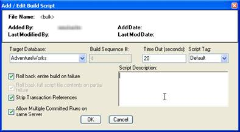

Updating Scripted Objects
-------------------------

Once you have added a [database object script to your build
project](#_Scripting_Database_Objects), what happens if you update your
database again and need to re-sync your scripts? *Sql Build Manager *has
an answer for that as well. Because it generates scripts with both a
defined extension (.PRC, .UDF, .TAB, .VIW for stored procedures,
functions, tables and views respectively) and a pre-defined header
section - it can also determine how to update those scripts from the
source.

1.       Start be selecting one (or more) scripts from your project list
that have the extensions listed, and the "Update Object Create Scripts"
context menu item will be enabled. From here, you have two choices: use
the settings from the original script header or use the target database
override setting (see that advanced topic).


2.       Once you have selected how to re-generate the scripts, you are
presented with a confirmation window (similar to the one from the
original scripting), then just click "Update Checked Files" update the
scripts in the project file.

-    

3.       You can also update the scripts for *all*scriptable objects in
the project file via the "Scripting --> Update Object Create Scripts" main
menu option.

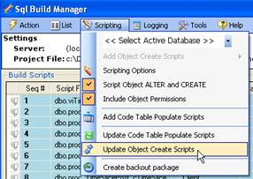

Creating a -->Back out Package-->
-----------------------------

There may be an instance where after you have already committed a
package to an environment that you realize something is wrong and you
need to back out your changes. Since you-->ve committed and you can-->t do a
rollback, you could restore from a backup copy. Alternatively, you can
create a back out package that will revert your changes. Sql Build
Manager can automate much of this back out creation as long as you have
an unaltered version of the database somewhere (i.e. to this BEFORE you
apply your changes to your production database!). To get started, click
on the -->Scripting --> Create back out package--> main menu option.


This will open update the Backout Package form. To change your database
source to an unaltered version of your database, use the -->Action -->
Change SQL Server Connection--> menu option, selecting both your server
and database name. The selection will appear in the gray panel for
reference. The two list boxes are as follows:

-->Scripts that will be updated--> --> these are scripts that the Sql Build
Manager recognizes as having been scripted through the tool. Because of
this, it will know how to re-script them from the new target.

-->Scripts that will NOT be updated--> --> scripts in this list fall in 1 of
two categories.

- First, is -->Not found on Target Server--> --> this means that the
object in your build package hasn-->t been created on the new source.
Since this is a new object, you must decide on your own what to do with
it (i.e. leave it there since it-->s new and it doesn-->t really matter, or
create a drop script

- Second, is -->Manual Scripts--> --> this means that the script is
something you wrote, not something the tool created for you. Because of
this, you will need to determine what action needs to be taken for a
back out.

Once you have set the source server and database, reviewed this lists,
and set the back out file name (which will default to
-->Backout\_\<original package name\>-->, just click the -->Create Back out
Package--> button. If there are any errors, the back out package will not
be created and you can use the -->Help --> View Application Log File--> link
to view the errors.


Reporting and Adhoc Queries
===========================

Script Status Reporting
-----------------------

This process will check across multiple databases to see whether or not
the scripts configured in your Sql Build File (.sbm or .sbx) have been
run on those databases and if they have been run, whether or not they
are in sync with the build file.

1.  From the main Sql Build Manager window, select Action --> Configure
    Multi Server/Database Run


2.       Configure the databases you want to generate the report
against.--> (See [Configuring Multiple Database
Targets](#_Configuring_Multiple_Database))

3.       From the opened Multiple Database Run Configuration Page,
select--> the Reports --> Script Status Report menu item


4.       The Script Status Reporting window will display.


From this window, you can select the output type you would like for the
report.

Summary: A pared down report that shows only scripts that are not
synchronized between the build file and the target database and presents
in an -->-->HTML document.

HTML: A full HTML report showing the status of all the scripts in the
build file. Those that are out of sync are presented in red.

CSV: A full report showing the status of all scripts in the build file.

XML: A full report of the raw data for all the scripts in the build
file.

5.       To get the report, click the Generate Report button. You will
be prompted to provide a file name to save the report output, and then
the program will thread out the processing, collate the results and
present the report in the default viewer for the specified file type.

###  

Object Comparison Report
------------------------

This report option will scan your configured database and generate hash
values for all of the database objects in them. It will then create a
report showing which objects are not in sync with the baseline database
chosen. NOTE: running this report may be very time consuming depending
on the number of objects in the databases and the number of databases
configured for comparison.

1.  From the main Sql Build Manager window, select Action --> Configure
    Multi Server/Database Run


2.       Configure the databases you want to generate the report
against.--> (See [Configuring Multiple Database
Targets](#_Configuring_Multiple_Database)). The database that is
configured with the lowest sequence number will be used as the baseline
database.

3.       From the opened Multiple Database Run Configuration Page,
select -->the Reports --> Object Comparison Report menu item


4.       The Object Comparison Report form will display.


From this window, you can select the output type you would like for the
report.

Summary: A pared down report that shows only the objects that are not
synchronized between databases. This report will present the server,
database, object type, object name and status of that object with
relation to the base database.

XML: A full report of the raw data for the objects in the database

You also have the option to run the report in parallel/threaded fashion
or single threaded. While the parallel option will generally be faster,
it does have the potential to impact the responsiveness of your
computer.

6.       To get the report, click the Generate Report button. You will
be prompted to provide a file name to save the report output, and then
the program will begin processing. The status of the processing on each
database is displayed in the table. Once complete it will collate the
results and present the report in the default viewer for the specified
file type.

7.       After the processing is completed, the -->Additional Analysis-->
button is enabled. Clicking this button will present a Comparison
Analysis window where you have the ability to change the baseline
database to be any database that was used in the comparison. Selecting a
database and clicking Generate Report will create a new summary report
and open it in your default HTML viewer. Note that this option does not
re-scan the databases but rather reuses the data gleaned in the original
run so there is no processing delay or performance impact.


 

 

Running Adhoc Queries against multiple targets
----------------------------------------------

This option allows you to run any query you specify against multiple
databases at once. These databases can be spread across multiple servers
as well. A report with the collated results is presented in the format
you select.

1.       From the main Sql Build Manager window, select Action -->
Configure Multi Server/Database Run


2.       Configure the databases you want to run the Adhoc query
against.--> (See [Configuring Multiple Database
Targets](#_Configuring_Multiple_Database))

3.       From the opened Multiple Database Run Configuration Page,
select--> the Reports --> Adhoc Query Execution menu item


4.       The query window will display. In this window, you have the
option to select the output type for the report:

CSV - comma separated values

HTML - a formatted HTML report

XML - the raw data retrieved in XML format.

Also through the Action menu item, you can Open or Save a SQL query for
reuse.


5.       Once you have selected your output type and either typed in
your query or opened an existing query from a file, click the Run Script
button. You will be prompted for a location and file name to save the
results then the program will then thread out the execution of the
script to all of the database targets you specified in step \#2, collect
the data, collate it and open the output file in the default viewer for
the specified file type. The columns included in the report are the
server name, database name, row count and then the columns specified in
the query you provided.

 

Stored Procedure Testing
========================

 

Stored Procedure Testing-Setup
------------------------------

#### Creating your first test configuration 

1.       You access the stored procedure testing module via the main
screen *Tools | Stored Procedure Testing *menu option


2.       This will open up a new Stored Procedure Test Configuration
window. To get going, you will need to create a new test configuration.
Use the File --> Open/New Test Configuration menu option to open up a file
dialog window. Type in your file name and click "Open". You will now see
a "Select Database" window populated with the list of databases
available on your current server. A configuration can only address a
single database, so if you need to test different stored procedures on
another database, you will need to create another configuration. Note
however, if you have two or more databases with the same stored
procedures, you can use a single configuration across those databases.


3.       Now that you have your database set, you can start selecting
stored procedures and creating test cases.

#### Adding Stored Procedures

1.       To add your first test case, right-click n the white area on
the left (this is where your selected stored procedures and test cases
will soon display) and select the only active option - Add New Stored
Procedure; this will give you the Stored Procedure list:

-->


2.       From this list (which shows all of the user stored procedures
on the target database that have not been previously selected), check
the stored procedures that you want to create test cases for (this will
eventually be all of them right?) and click "Add Checked Files".

#### Creating a test case

1.       To create a test case, select a stored procedure from the left
side list and right-click to pull up the menu. From this menu, select
"Add New Test Case to \<sp name\>".


2.       This will then activate the right side, test configuration
section of the screen where you can set-up the test


#### Test Case Definition\
 \

1.       *Name *- required. Sets the descriptive name of the test. This
is what will appear in the tree view on the left of the screen

2.       *Execution Type* - required. A drop down selection of \
 ReturnData: expects that a result set with 1 or more columns and
possibly 0-n rows returned\
 NonQuery: a stored procedure that does not return data (an insert,
update or delete for example)\
 Scalar: expects that the result set consists of a single data point
(i.e. 1 row with 1 column)

#### Parameters \
 \

1.       *Parameters *- optional based on the stored procedure. These
are the parameters derived from the stored procedure as it exists in the
database. The type of each can be displayed by hovering over the name of
the parameter.

2.       *Parameters with "Sql Query" *set - optional. This will create
an array of unit tests, one for each result set of the query. For
example, if the employee table has 10 employees, and you paste in a SQL
statement "SELECT EmployeeID FROM Employees", then save and execute the
test, you will run 10 tests.\
 NOTE: The query should only return one column of data. Also if there
are multiple parameters, this can be used in combination to create an
exponential number of tests.

#### Expected Results

1.       *Result* - required. One of 4 result types must be set for the
execution of the stored procedure:\
 Success: The stored procedure executed properly. No exceptions were
thrown by SQL Server\
 GenericSqlException: If you expect that with your parameter values set,
you will get an execution exception\
 PKViolation: If you are forcing a Primary Key violation with your
parameter values\
 FKViolation: If you are forcing a Foreign Key violation with your
parameter values 

2.       *Row Count *-optional. If you want to check that the proper
number of rows is returned with the stored procedure, you can set this
value.

3.       *Row Count Operator *- optional. Used in conjunction with the
Row Count number. It allows you to specify that the row count be
EqualTo, GreaterThan or LessThan the number specified in the Row Count.

4.       *Column Count* - optional. If you want to check that the proper
number of rows is returned, you can set this value.

#### Expected Data Output

You can add as many of these data checks as you'd like by clicking the
"Add Expected Output" link button. For each one, there are 3 settings:

1.       *Column Name* - required. The name of the column that you would
like to perform a data value check against.

2.       *Value *- required. The value that you expect in the designated
column. NOTE: the value check is not case sensitive and does perform a
trim, so extra spaces are also ignored.

3.       *Row \#* - optional. The row number of the returned data that
should be checked for the value. If not specified, the first row is
checked. Also, for you developers out there, this is a "1" based value
so the first row returned would be Row \#1 not Row \#0.

#### Additional Features

-   **Get SQL Script**- generates for you the SQL that will be executed
    bases on the current parameter value setting to allow you to cut and
    paste as needed.
-   **Insert Type Default Values** - puts in a non-null value for each
    parameter. For numeric, it adds the default value of 0. For strings
    and characters is adds in an empty string. For date/time, it adds
    the current date and time.
-   **Paste Execution Script** - if you use SQL server profile, you can
    paste in the execution script you glean from there. The tool will
    parse out the parameters and values and insert them into the proper
    place.

 

Stored Procedure Testing - Execution (Manual and Automated)
-----------------------------------------------------------

Once you have set up your stored procedure tests, you'll of
course want to run them, this will explain how to do that and also
interpret the results you see.

### Running your stored procedure tests (manual)


1.       Execution of your tests is very straightforward. Simply check
the tests you want to run (or use the "Check All" link) and click the
"Run Checked Test" button. An execution/results window will open up and
the tests will automatically start.


### Interpreting the results

1.       The tool will run through all of the tests you had checked,
logging the results for each test and displaying the summary results in
the execution window


2.       For each test run, you will get a result row, with an
success/failure indicator, the stored procedure name, the test case name
and the results summary.(Note: if there is a failure, the row will be
highlighted in red). There is also a summary across the bottom, listing
the number of stored procedures that were tested, the number of test
cases executed, the number passed and the number failed.

3.       To view the result details of the test, you can right-click on
the results row and select "Show Detailed Results". The detail window
will pop-up. In the top section you will get the same information as the
summary, however the results is now fully displayed showing all of the
criteria that were used in the test and the actual results retrieved. In
the bottom section, the actual SQL that was executed is shown in case
you need to retrieve it for another use.


### Saving the results

If you need to save your results for later review or for proof of
testing, you can do that too. From the results summary page, you can
right-click and display the menu. Select the "Save All Test Results".
The resulting file will be an XML document that contains all of the
detailed information regarding the test execution that you can get via
the forms above, plus the name of the target server, target database,
and start and end times. Also, the test case definition is included with
each result.


Automating stored procedure testing
-----------------------------------

You can easily automate your stored procedure testing by taking
advantage of the console helper executable and [command-line
execution](#_Command_Line_Execution). Running a stored procedure test,
you will need 4 command line parameters:

-   /test=".sptest config file" - informs the tool that you will be
    performing a stored procedure test execution using the supplied test
    configuration file.
-   /server=serverName - sets the target server to connect to

-   /database=target server - sets the target database to run the stored
    procedures on

-   /log=logfilename.xml - sets the name of the XML results file you
    want the results sent to.

Example: SqlBuildManager.Console.exe /test="test3.sptest"
/server=myserver /database=myDb /log="C:\\logfile.xml"

Additional Program Information
==============================

Associated File Types
---------------------

The application has multiple file types associated with it at install
time. These files serve many purposes for different features of the
application.

- **.sbm** : Single
file package that contain the scripts, script metadata and run result
history for the package.

 

- **.sbx** : XML
configuration file. This contains the script metadata for run time
settings. The scripts are assumed to be in the same folder as the .sbx
file. This file can be packaged into a single .sbm file via the Action -->
Package Scripts into Project File (.sbm) menu option.

 

- **.sbe** : A
-->Sql Build Export--> file. The product of an export of scripts from a .sbm
file. This is essentially the same as a .sbm file, but is used to denote
scripts that are intended to be imported into another sbm file.


- **.multiDb** :
**Multi-database execution
configuration file. See [Configuring Multiple Database
Targets](#_Configuring_Multiple_Database).

** **

- **.multiDbQ** :
**Multi-database
configuration query file. See [Create Configuration via
Query](#_Create_Configuration_via)

 

- **.audit** : a
auditing script creation template file. These files are used to create a
group of tables that require data auditing.--> The program can then
generate audit tables and triggers for these tables.

 

- **.sqlauto** : a
configuration file for automated schema scripting. This can be used for
creating a scheduled task to generate DDL scripts for databases on a
regular basis

 

- **.sts** : Sql
Table Scripting. A configuration file of -->look-up--> or -->code tables-->.
From this, the program can create script files that can be used to
replicate their contents to other environments. These scripts are
re-runable and handle both inserts and updates of values.

 

- **.sptest** :
Stored Procedure test
configuration file. With not programming, the application can create
unit tests for stored procedures. You can supply standard or query based
input values and interrogate execution times and return values to
determine pass/fail criteria.

 

Database Analysis
=================

Sql Build Manager has the built in features to run size and utilization
analysis against a SQL server.


Server Analysis
---------------

1.       Upon selecting the Tools --> Database Analysis menu option, the
Database Size Summary window will open. On loading, it will begin
scanning the current server (as identified in both the title bar and the
-->Recent Servers--> drop down box to gather the data.

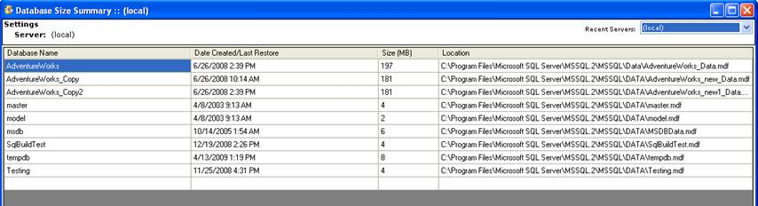

2.       Once the scan is complete, you the grid will be populated with
four pieces of data for each database associated with the server:

- Database Name --> fairly obvious!

- Date Created/Last Restore --> this is the date that the
associated master database has for the creation date of the database.
This date is updated whenever a database is restored from a back-up as
well

- Size (MB) --> again, fairly obvious. This is the size that SQL
Server has allocated for the database MDF file.

- Location --> The physical drive path where the MDF file is
located. Note that the path is relative to the SQL Server, not your
local machine.

3.       You can run analysis on another server by changing the database
selection in the -->Recent Servers--> drop down

 

Individual Database Details
---------------------------

1.       From the Database Size Summary form, you can gather individual
database details by right-clicking on the database and selecting the Get
Database Details menu item.

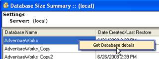

2.       The size analysis for the selected database will run and load
the data form. This contains data about each table in the database.
(These columns are all sortable)

- Table Name --> obvious.

- Row Count --> the number of rows that SQL Server currently
reports from its statistics (not always the same as a -->SELECT
count(\*)-->--> query, but generally very close

- Data --> the size of the data stored in the table (in KB)

- Indexes--> - the size of all of the indexes associated with the
table (in KB)

- Unused --> the amount of space that is allocated to the table
but it currently empty (in KB)

- Total --> the total amount of space that SQL Server has
allocated for this table and all of its indexes

- Average Data --> the average amount of space used per row in the
table

- Average Index --> the average amount of space used per row for
all of the indexes on the table

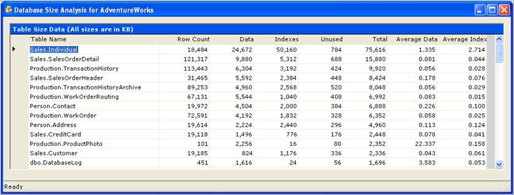

 

Data Extraction and Insertion
=============================

Sql Build Manager has the ability to extract non-binary data out of a
table and store it in a formatted file. Conversely, it can take this
formatted data and create pairs if INSERT/UPDATE statements for
reinsertion and or updating of this data. It can also be used to
synchronize data between environments. \
 NOTE: There is a current limitation with this extract. It will not
properly handle data that contains in-line carriage returns. This will
cause a formatting error of the insert/update scripts.

Data Extraction
---------------

1.       Open the Data Extraction form via the Tools --> Data Extraction
menu item from the main window


2.       On the Data Extract window, you will need to do the following:

a.       Select your output directory via the Action --> Change
Destination Folder menu .

b.      Select your source database with the -->Select Database--> dropdown
list. (You can change your server via the Action -->Change SQL Server
Connection menu item or the Recent Servers list)

c.       Once you select the database, the Tables to Script list will
populate with the table list for that database as well as the row count
for each table.

d.      Next, check the tables you want to extract from and click the
-->Extract Data--> link.

e.      The files that were created display in the -->Extract Results-->
list. If you want to open a file, you can right-click on it and select
-->Open File-->.


 

Data Insertion Script Creation
------------------------------

Once you have [extracted data](#DataExtractionandInsertion), what are
you to do with it? Well, you can always generate scripts to put it back!
This is useful create a restore for a table and also to move data easily
from one environment to another. In order to get it back into a table,
you-->ll need to create the INSERT/UPDATE script combinations for the
extracted data.

1.       Open the Data Extract Script Creation Form via the Tools -->
Create Scripts from Extracted Data menu option.


2.       Open a data extract file (\*.data) via the Action --> Open Data
Extract File menu item. Once you select the file, its contents will be
loaded into the top text box and the script creation process will be
kicked off. The generated scripts are displayed in the bottom text box.
These scripts are suitable to be copied and pasted into a Sql Build
Manager project file or SQL management studio window for execution.


 

Database Object Validation
==========================

Do you know if your database views, stored procedures and functions are
all in sync? Are all of your table references correct? This
functionality attempts to scan your database and alert you of potential
errors --> before you find them at runtime. The validation consists of the
following checks:

- *Execution of**sp\_helptext system procedure for the objects*:
This checks to ensure that there is no discrepancy in the object
registration in the database

- *SQL parsing*: Runs a SQL server query parse for the object
definition. This uses SQL server-->s built-in functionality to run through
the definition and check for the validity of referenced--> tables,
columns, views, etc

- *Execution of**sp\_depends system stored procedure for the
objects*: Another means for SQL Server to check the validity of table
references. NOTE: If there is a cross-database join. SQL server will not
necessarily detect the dependency, in which case the validation will
return a status alerting you of such.

1.       Open the Database Object Validation form using the Tools -->
Database Object Validation menu item.


2.       On the form, select the database you want to check in the
database dropdown list. (You can also change your SQL Server connection
via the Action --> Change Sql Server Connection menu option or Recent
Servers list).


3.       The list will populate with the checked Stored Procedures (type
-->P-->), Function (type -->FN-->) and Views (type -->V-->). There are 4 status
types that you can get in the result:

a.       Valid --> self explanatory. The object passes the validation
tests

b.      Invalid --> again, self explanatory. The object fails one of the
validations. You will get a detail of the failure in the Results column.

c.       Caution --> a warning. This doesn-->t necessarily mean that the
object is invalid, but will let you know what to look for in the Results
column.

d.      Cross Database Join --> another warning. The tool detected a
possible join across databases and lets you now that is could not fully
validate the references.

If there are any items that do not return a Valid status, the warning
message will display.

Rebuilding Previously Committed Build Packages
==============================================

One of the useful features of the logging that Sql Build Manager
performs is that it allows the tool to also reverse engineer a build
package that has been committed to a database (or combination of
databases). This allows you to re-create a package with all of the
scripts of the original to archive off, or run against another
environment.

1.       Open the Rebuild Sql Build Manager File form with the Tools -->
Rebuild Previously Committed Build File menu item


2.       When the form opens, it will automatically scan the server you
are connected to. It will populate the table with all of the build files
that it found, originally sorted in reverse chronological order. Also in
the list are the database(s) that the build file was run against, and
the number of scripts that were included in the file. You can change the
server via the Action --> Changes Sql Server Connection or Recent Servers
drop down


3.       Once you pick a build file to reconstruct, select it in the
list, then right-click and select Rebuild File context menu item. You
will then be prompted where to save the file.


4.       After the rebuild is completed, you will be prompted whether or
not you want to open this new file. Selecting -->Yes--> will--> you guessed
it--> open the file


5.       Once the file opens, you will notice that all of the scripts
are marked as -->Run Once-->. This may or may not have been the original
setting. The logging does not record your runtime settings, so it
defaults to the -->safest--> setting. You can however, update these settings
as needed for you to reuse the package.


 

## Enterprise / Team Settings


This feature in Sql Build Manager allows you to manage certain settings
for a team, rather than having an isolated/ per installation settings.
This is managed by a settings configuration file that needs to be
accessible by all of your users.

### Enterprise/Team Settings Configuration File

The team settings are controlled via a common configuration file that
each installation can read from. This can be handled via either placing
this file in a common file share or making it available via an http URL.
If for some reason the file is not readable, the tool will use settings
it was last able to retrieve. The configuration file in an XML formatted
file conforming to a specific XSD schema (this schema is called
EnterpriseConfiguration.xsd and can be found in your installation
folder).

### appSettings Key/Value Pair

To point your Sql Build Manager installation to the team configuration
file, you will need to edit the application configuration file Sql Build
Manager.exe.config. In this file add or edit the appSettings section-->s
key -->Enterprise.ConfigFileLoation--> and set the value to either a file
share location, UNC path, or HTTP URL where you team settings file can
be found. Upon restarting the application, it will now use this file for
team settings.


 

 

 

Script Change Settings
----------------------

### Table Change Watch

This team setting lets you put -->alerts--> on table changes. It detects
ALTER TABLE and DROP TABLE change scripts upon saving from the Edit
Script Text window. It then compares these table change scripts against
a list of tables that are being -->watched-->. If there is a match, the
alert window is displayed. This window gives the following information:

- Notice that this is a Table Change Watch, what it is and how
to send the notification

- A description of the alert --> should explain what the alert is
for

- A list of tables modified --> list the tables altered in your
script that matched an item in the watch list

- A list of folks that wanted the alert.

To give these folks their notice, you-->ll need to click the -->Send
Notification--> button (for each alert box if there is more than one).
This will open your default e-mail program with a configured, populated
e-mail --> just click -->Send-->.


### Configuring Table Change Watch

The file can contain one or more \<TableWatch\> elements and each of
these can contain one or more Table and Notify elements. You can use any
XML editor to help you create the file, but one that can validate
against the schema will be the most helpful.


 

Script Policy Settings
----------------------

[Script policies](#ScriptPolicyChecking) are enforced via configuration
so you can turn them on and off as needed. This is handled via
\<ScriptPolicy\> elements in the EnterpriseConfiguration.xml file. Each
script policy will have its own element and PolicyId value. You can turn
off policy enforcement by either removing the element or setting the
Enforce attribute value to false.\
 The current list of PolicyId-->s is:

- CommentHeaderPolicy

- ConstraintNamePolicy

- GrantExecutePolicy

- GrantExecuteToPublicPolicy

- QualifiedNamesPolicy

- ReRunablePolicy

- SelectStarPolicy

- StoredProcParameterPolicy

- WithNoLockPolicy


The StoredProcParameterPolicy is additionally configurable with 4
-->Arguments--> that are added via \<Argument\> sub-elements. The allowed
argument names are:

- Schema --> a stored procedure filter setting. Selects the schema
that the stored procedure must belong to in order to -->match--> for the
policy check.

- TargetDatabase --> a stored procedure filter setting. The target
database that the stored procedure needs to be targeted toward in order
to -->match for the policy check.

- Parameter --> the name of the stored procedure parameter (with
the -->@-->) that you want to make sure is included in the stored procedure
signatures.

- SqlType --> the SQL type of the parameter that you want to make
sure is included in the stored procedure signatures.

 

Feature Access Settings
-----------------------

There is the ability to activate/deactivate features by user. Currently,
the only feature that is under control is the access to the [Remote
Execution Service](#RemoteServicsExecutionandDeployment). The
\<FeatureAccess\> element contains both a FeatureId attribute
(currently, only -->RemoteExecution--> is valid) and a Boolean value of
Enabled. A sub-element of \<Allow\> takes a LoginId value that should be
set to the userid of the user that has access to the particular feature.


