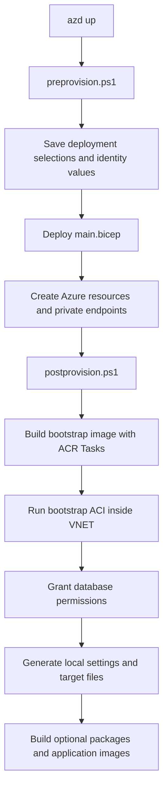

# `azd up` Deployment Lifecycle

This document explains what happens when SQL Build Manager is deployed with:

```powershell
azd up
```

It focuses on the lifecycle hooks, generated local files, managed identities, private database
networking, and the post-provision container used to initialize database permissions.

## Deployment overview

`azure.yaml` configures Azure Developer CLI to:

1. Run `infra/scripts/preprovision.ps1`.
2. Deploy `infra/main.bicep` with `infra/main.parameters.json`.
3. Run `infra/scripts/postprovision.ps1`.



The pre-provision and post-provision hooks run on the machine invoking `azd up`. The database
bootstrap container runs in Azure because SQL Server, PostgreSQL, and MySQL are private-endpoint-only and
cannot be reached directly from a normal developer workstation.

## Phase 1: Pre-provision hook

File: `infra/scripts/preprovision.ps1`

The pre-provision hook prepares the selected azd environment before Bicep parameter expansion.

### Capture the caller's public IP

The script retrieves the caller's public IP from `api.ipify.org` and saves it as:

```text
CURRENT_IP_ADDRESS
```

SQL Server, PostgreSQL, and MySQL no longer use this value because their public network access is disabled.
Other modules can still use it when those services are configured with public network access and
IP-based network rules.

### Capture the deploying identity

The hook reads the signed-in Azure identity and saves:

| azd value | Purpose |
|---|---|
| `AZURE_PRINCIPAL_ID` | Object ID used for RBAC and initial database administrator configuration |
| `AZURE_PRINCIPAL_NAME` | Login/display name used for database administrator configuration |

These values identify the person running `azd up`. They are not the application's runtime managed
identity.

### Select deployment targets

On the first run for an azd environment, the hook prompts for:

- Azure Batch
- Azure Container Instances
- Azure Container Apps
- Azure Kubernetes Service
- SQL Server
- PostgreSQL
- MySQL

The selections are stored under `.azure/<environment>/.env` as values such as:

```text
DEPLOY_BATCH
DEPLOY_ACI
DEPLOY_CONTAINERAPP
DEPLOY_AKS
DEPLOY_SQLSERVER
DEPLOY_POSTGRESQL
DEPLOY_MYSQL
```

Later runs reuse the saved selections. Change them with `azd env set` or by editing the environment
through azd rather than expecting the selection prompt to appear again.

### Force shared build infrastructure

Azure Container Registry is always deployed. It is required by the private bootstrap container even
when no application compute platform was selected.

The hook currently also sets these values to `true` on every run:

```text
BUILD_CONTAINER_IMAGES
GENERATE_MI_SETTINGS
```

Consequently, the runtime/test container images are rebuilt during each `azd up`. Setting these
values to `false` before `azd up` is not persistent because the pre-provision hook writes them back
to `true`.

### Generate the PostgreSQL and MySQL local administrator passwords

When PostgreSQL is selected, the hook generates `PG_ADMIN_PASSWORD` if it does not already exist.
When MySQL is selected, the hook generates `MYSQL_ADMIN_PASSWORD` if it does not already exist.
The values are saved in the azd environment and passed to Bicep as secure parameters.

The private bootstrap container does not receive these passwords. SQL initialization uses a
temporarily authorized bootstrap managed identity. PostgreSQL and MySQL initialization use
short-lived deploying-user Entra tokens passed as secure ACI environment values; runtime workers
continue to use their own managed identity.

MySQL deployment also stores:

```text
MYSQL_ADMIN_USER
MYSQL_AUTH_MODE
```

`MYSQL_AUTH_MODE` defaults to `ManagedIdentity` for Azure MySQL tests. Existing explicit `Password` selections are preserved for legacy deployments, but Azure MySQL tests require migration to identity settings. Local/local-container tests remain native-authenticated.

## Phase 2: Bicep deployment

Entry point: `infra/main.bicep`

The Bicep deployment creates a resource group and composes the resource modules selected by the
pre-provision hook.

### Core resources

The deployment includes:

- A virtual network and dedicated subnets for AKS, Container Apps, ACI, Batch, and private endpoints.
- Separate SQL Build Manager worker and orchestrator user-assigned managed identities.
- A separate post-provision user-assigned managed identity.
- A dedicated Relay proxy identity, Azure Relay Hybrid Connection, and persistent ACI.
- Azure Container Registry.
- Storage, Event Hubs, Service Bus, and Log Analytics.
- Selected compute platforms.
- Selected SQL Server, PostgreSQL, and MySQL resources.

### Runtime managed identity

The runtime identity is named:

```text
id-{env}-worker
```

It is used by SQL Build Manager workloads running in Batch, AKS, ACI, and Container Apps. It has
resource-scoped Blob access, Service Bus receive access, Event Hub send access and ACR image-pull
access. It does not receive resource-group Contributor, AKS administrator, Microsoft Graph or
managed-identity assignment permissions.

Azure RBAC cannot create a contained database user. Database-specific permissions are added later by
the private bootstrap container.

### Orchestrator managed identity

`id-{env}-orchestrator` manages worker compute, Batch pools/jobs/tasks, Service Bus subscriptions
and rules, Event Hub consumer groups, result monitoring and cleanup. Its permissions are scoped
to the relevant deployment resources; dynamically created compute requires compute-specific
permissions at resource-group scope, not generic Contributor.

The trusted Azure test-runner container attaches both orchestrator and worker identities. Azure CLI
and the SBM Azure-service credential helper select the orchestrator explicitly using
`AZURE_CLIENT_ID` and `SBM_ORCHESTRATOR_CLIENT_ID`. Direct database tests can still request the
worker identity's token. Worker containers receive only the worker identity and never receive
`SBM_ORCHESTRATOR_CLIENT_ID` in generated runtime configuration.

Outside the Azure test runner, leave `SBM_ORCHESTRATOR_CLIENT_ID` unset for existing developer
CLI/PowerShell authentication. On a managed-identity orchestration host, set it to the separately
attached orchestrator client ID. A specified invalid or unavailable identity is an error, not a reason
to fall back to a different principal.

AKS orchestration uses a normal user kubeconfig and namespace-scoped workload permissions.
The deployment operator creates the `sqlbuildmanager` namespace and service account first.
Runtime job submission no longer creates namespaces or requires cluster administrator access.

### Post-provision managed identity

The bootstrap identity is named:

```text
<prefix>postprovision
```

It is separate from the runtime identity to avoid permanently granting the application identity
database-administrator privileges.

It receives:

- Read access needed to discover the deployment's identities and databases.
- Registry-scoped `AcrPull` so ACI can pull the private bootstrap image without registry credentials.

The ACR administrator account is disabled. Image pull uses this managed identity.

### Relay proxy identity

The proxy identity is named:

```text
<prefix>relayproxy
```

It receives `Storage Blob Data Contributor` on the deployment Storage account, `Azure Event Hubs
Data Receiver` on the deployment Event Hubs namespace, `AcrPull` on the registry, and `Azure Relay
Listener` on the `relayproxy` Hybrid Connection. The deploying user
receives `Azure Relay Sender` on the Relay namespace through an idempotent post-provision check that
reuses existing assignments regardless of their resource GUID. Relay's HTTP sender authorization is evaluated
at namespace scope even when the request targets a specific Hybrid Connection. VNET runtime
identities do not receive Relay Sender because their data-plane operations use private endpoints
directly.

The proxy does not use Storage account keys or create SAS tokens. Azure Relay authenticates the
caller with Microsoft Entra ID. The proxy uses its dedicated identity for Blob and Event Hub
operations and its own explicitly granted SQL test-database identity for restricted SQL operations. It does not attach the worker or orchestrator identity. This avoids an
on-behalf-of flow, which would require an application registration, delegated service scopes, and
a second end-to-end token validation layer inside the proxy.

### Database networking

SQL Server, PostgreSQL, and MySQL all have:

- Public network access disabled.
- No current-IP firewall rule.
- No "Allow Azure services" firewall rule.
- No SQL service-endpoint virtual network rule.
- A private endpoint for each server.
- A private DNS zone linked to the deployment VNET.

Database traffic must originate from the VNET, a peered network, or a client connected through an
appropriate VPN/private DNS configuration.

The private endpoint subnet is used only for private endpoint network interfaces. The bootstrap
container runs in the separate ACI subnet delegated to
`Microsoft.ContainerInstance/containerGroups`.

### Database administrators

For SQL Server, Bicep initially configures the deploying user as the Microsoft Entra administrator.
SQL Server supports one Microsoft Entra administrator, so the post-provision hook temporarily swaps
this administrator while the bootstrap container runs.

PostgreSQL Bicep configures the deploying user as its Entra administrator. Private initialization
uses that user's short-lived token, securely handed to the bootstrap container. No PostgreSQL
administrator assignment or database login is created for the bootstrap managed identity. This
avoids residual administrator-role cleanup altogether for fresh deployments.

MySQL Bicep resources are created with:

- A local administrator (`MYSQL_ADMIN_USER` / `MYSQL_ADMIN_PASSWORD`).
- A dedicated `id-{env}-mysql-directory` user-assigned identity for server-side directory lookups.

When `MYSQL_AUTH_MODE=ManagedIdentity`, postprovision grants the server identity's Graph permissions **first**, then configures the deploying Entra user as MySQL administrator using `scripts/Database/set_mysql_entra_admin.ps1`. Administrator creation is deliberately outside the initial Bicep deployment so it cannot race missing Graph permissions on a fresh environment. Private bootstrap then creates and authorizes the runtime database identity.

### Outputs returned to azd

Bicep exposes resource names, IDs, subnet IDs, identity IDs, and registry endpoints as outputs. azd
stores these values in the active environment for the post-provision hook. Important outputs include:

```text
ACI_SUBNET_ID
CONTAINER_REGISTRY_NAME
CONTAINER_REGISTRY_LOGIN_SERVER
MANAGED_IDENTITY_NAME
MANAGED_IDENTITY_CLIENT_ID
MANAGED_IDENTITY_PRINCIPAL_ID
POSTPROVISION_IDENTITY_NAME
POSTPROVISION_IDENTITY_ID
POSTPROVISION_IDENTITY_CLIENT_ID
POSTPROVISION_IDENTITY_PRINCIPAL_ID
```

## Phase 3: Post-provision hook

File: `infra/scripts/postprovision.ps1`

The post-provision hook combines operations that must run locally with operations that require VNET
connectivity.

## Private database initialization container

Orchestrator:

```text
scripts/ContainerRegistry/run_private_postprovision_container.ps1
```

Container definition:

```text
infra/postprovision/Dockerfile
infra/postprovision/run-private-postprovision.ps1
```

### Why a container is required

Creating the Azure SQL, PostgreSQL, and MySQL server resources is an ARM control-plane operation. Creating a
database user and granting database roles is a database data-plane operation.

With public access disabled, a local post-provision hook can still call ARM but cannot open a database
connection unless the workstation is connected to the VNET. The bootstrap ACI solves this by running
inside the delegated ACI subnet, where private DNS resolves the database hostnames to their private
endpoint addresses.

### Why the ACI is created by the hook

The bootstrap image does not exist in ACR during the first Bicep deployment. The hook therefore uses
a two-stage process:

1. Bicep creates ACR, the VNET, identities, databases, and role assignments.
2. The post-provision hook builds the image and then creates the ACI.

The ACI is intentionally imperative rather than a Bicep resource. Each `azd up` deletes the previous
container group and recreates it from the newly built image.

### Remote ACR build

The hook creates a minimal temporary build context containing:

- The bootstrap Dockerfile.
- The container entry script.
- SQL Server permission-grant script.
- PostgreSQL permission-grant script.
- MySQL permission-grant script.
- Shared resource-name script.

It then runs:

```text
az acr build
```

The build executes remotely through ACR Tasks. Docker does not need to be installed or running on the
developer workstation. Post-provision suppresses successful ACR build logs and reports only command
failures. Once the private initialization ACI starts, its stdout and stderr are attached to the
`azd up` console so database permission changes remain visible as they run.

The image is published as:

```text
sqlbuildmanager-postprovision:latest
```

The image contains:

- PowerShell
- Azure CLI
- Microsoft ODBC Driver for SQL Server
- `SqlServer` PowerShell module
- PostgreSQL `psql`
- MySQL `mysql` client
- The private initialization scripts

### Temporary SQL Server administrator swap

Before starting ACI, the local orchestrator:

1. Enumerates the generated SQL logical servers and captures each existing Entra administrator.
2. Temporarily replaces that administrator with the post-provision identity.
3. Records each attempted swap so cleanup can restore the captured state even if initialization fails.
4. Waits briefly for the administrator change to propagate.

The swap is a control-plane operation and does not require database network connectivity.

The administrator is changed only long enough for the bootstrap identity to connect and create the
worker and Relay contained database users. Cleanup restores each server's captured administrator,
not an assumed deploying-user value.

### ACI creation

The hook creates:

```text
<prefix>postprovision
```

with:

- Linux as the explicit container-group operating system.
- The post-provision user-assigned managed identity.
- Identity-based ACR pull.
- The delegated ACI subnet.
- No public database access.
- Restart policy `Never`.
- Deployment flags passed as non-secret environment variables.

ACI creation is retried while new role assignments propagate.

### Container authentication

Inside the container, the entry script runs:

```text
az login --identity --client-id <post-provision-client-id>
```

No client secret, registry password, SQL password, PostgreSQL password, or MySQL password is passed to the container.

### SQL Server initialization

Script:

```text
scripts/Database/grant_identity_permissions.ps1
```

For generated `SqlBuildTestN` databases on both logical servers, the script:

1. Gets an Azure SQL access token for the post-provision identity.
2. Connects through the SQL private endpoint.
3. Creates a contained external user for `id-{env}-worker` if it does not exist.
4. Adds the user to `db_owner`.

When Relay is enabled, it receives a separate contained user with `CREATE TABLE`, `VIEW DEFINITION`
and the required `dbo` schema ALTER/DML privileges for test-table creation and DACPAC extraction,
not worker `db_owner` or a server administrator role.

The user is created from the runtime identity's client ID with an explicit SQL SID and `TYPE = E`.
This avoids a Microsoft Graph directory lookup and therefore avoids granting Directory Readers to
the SQL logical server.

Connection attempts are retried to allow private DNS and administrator changes to propagate.

### PostgreSQL initialization

Script:

```text
scripts/Database/grant_pg_identity_permissions.ps1
```

For both PostgreSQL servers, the script:

1. Receives the deploying Entra user's short-lived `oss-rdbms` token through `PG_BOOTSTRAP_ACCESS_TOKEN`, with the administrator login in `PG_ENTRA_ADMIN_LOGIN`.
2. Connects with `psql` through the PostgreSQL private endpoint.
3. Maps `id-{env}-worker` with `pgaadauth_create_principal_with_oid`.
4. Grants database connection, schema creation/use, existing table/sequence privileges and the persistent deploying user's table/sequence default privileges only on generated `sbm_pg_testN` databases.

The PostgreSQL role uses the runtime identity's object/principal ID and type `service`. Explicit OID
mapping avoids a Microsoft Graph lookup.

The worker owns objects it creates. Table/sequence `GRANT ALL` does not confer ownership of
objects created by another role or permit arbitrary ALTER/DROP of those objects. Default privileges
apply to objects subsequently created by the persistent deploying user, not every database role.
No bootstrap identity role, administrator membership or default-privilege ownership is created. Private
bootstrap fails if its user-token handoff is missing, instead of falling back to bootstrap-identity
database administration.

### MySQL initialization

Script:

```text
scripts/Database/grant_mysql_identity_permissions.ps1
```

This step runs only when:

```text
DEPLOY_MYSQL=true
MYSQL_AUTH_MODE=ManagedIdentity
```

For both MySQL servers, the script:

1. Uses the deploying Entra user's `oss-rdbms` token, acquired by the launcher just before ACI creation and supplied through a secure environment variable.
2. Connects with `mysql` through the MySQL private endpoint, verifying TLS; the token is supplied through temporary `MYSQL_PWD`.
3. Creates an Entra-backed MySQL user for `id-{env}-worker`, or verifies an existing mapping without dropping/replacing users.
4. Grants database-scoped privileges only on `sbm_mysql_testN` databases, not global privileges.

Managed-identity MySQL initialization requires Graph directory-read permissions for MySQL's Entra user resolution path. The local post-provision step can grant those permissions with:

```text
scripts/Database/grant_mysql_graph_permissions.ps1
```

### Completion and failure handling

The local hook polls ACI for up to 30 minutes.

On completion it:

1. Prints the container logs.
2. Verifies the container terminated.
3. Requires exit code `0`.

The launcher deletes the bootstrap container group in `finally`; it is not left deployed with a
reusable bootstrap identity after initialization. Use the streamed provisioning output for
post-run diagnostics, or inspect the container while provisioning is still running.

The SQL administrator restoration runs in a `finally` block whether image deployment, ACI execution,
SQL initialization, PostgreSQL initialization, or MySQL initialization succeeds or fails. Restoration is retried five
times for every SQL server that was successfully switched.

If restoration cannot be completed, the hook fails and reports the affected server. The bootstrap
identity might remain the SQL administrator and should be corrected with Azure CLI or the portal
before continuing. PostgreSQL creates no temporary bootstrap administrator. Bootstrap-container
deletion is also checked; cleanup failure is not reported as a successful deployment. The parent
clears each database token after its corresponding initialization and does not pass it to unrelated
database subprocesses.

## Remaining local post-provision operations

Operations that only use ARM control-plane APIs or write local files remain on the `azd up` machine.
They do not require direct database connectivity.

### AKS initialization

When AKS is selected, the hook:

1. Downloads a normal user kubeconfig for the deploying operator, which has AKS RBAC Cluster Admin on this cluster for setup.
2. Creates the `sqlbuildmanager` namespace without distributing cluster-admin credentials to workloads.
3. Applies a Kubernetes service account associated with the runtime managed identity through
   workload identity.

The service account is applied declaratively and can be updated on later runs.

### Private service Relay proxy

The hook runs:

```text
scripts/ContainerRegistry/build_and_deploy_relay_proxy.ps1
```

The script always builds `sqlbuildmanager-relayproxy:latest` remotely with ACR Tasks and
recreates the persistent Linux ACI `<prefix>relayproxy` in the delegated ACI subnet. The container
uses its dedicated identity for both the ACR pull and runtime access.

The listener connects outbound to:

```text
https://<prefix>relay.servicebus.windows.net/relayproxy
```

The Relay namespace remains publicly reachable for authenticated senders. Listener-side Relay and
Blob traffic resolve through private endpoints inside the VNET. No inbound port or public IP is
assigned to ACI.

Generated managed-identity settings include `--relayproxyendpoint`. SQL Build Manager first attempts
Blob operations directly with Entra authentication. Network and Storage authorization failures fall
back to the Relay proxy. The proxy supports container lifecycle checks, blob enumeration with an
optional prefix, streamed upload/download, and server-side log/query consolidation; it returns
ordinary Blob URLs, never SAS URLs.

Local SQL external-test setup is also direct-first. Azure SQL error `47073` activates restricted
Relay operations that create generated test tables and extract DACPACs inside the VNET. The proxy
accepts only SQL server FQDNs provisioned in the resource group and does not expose arbitrary SQL.

Event monitoring is also direct-first. It uses Blob-backed Event Processor checkpoints when those
private endpoints are reachable, then tries direct checkpointless Event Hub readers if only Storage
is blocked. Relay monitoring starts only when Event Hubs explicitly rejects the direct reader because
the caller IP is outside the allowed VNET. Workloads already running in the VNET do not relay events.

Code that explicitly needs Relay can enumerate a container and download any selected subset:

```csharp
var files = await StorageManager.EnumerateBlobFilesThroughRelayAsync(
    "batch-output",
    prefix: "worker-1/");

var downloaded = await StorageManager.DownloadBlobFilesThroughRelayAsync(
    "batch-output",
    files.Where(file => file.Name.EndsWith(".log")).Select(file => file.Name),
    @"C:\temp\batch-output");
```

Nested blob paths are preserved beneath the destination directory. Unsafe names that could escape
that directory are rejected before any download begins.

The same operations are available from the local CLI. The settings file supplies the Relay
endpoint and identity configuration:

```powershell
sbm storage list `
  --settingsfile .\src\TestConfig\settingsfile-aci-mi-only.json `
  --container batch-output `
  --prefix worker-1/

sbm storage download `
  --settingsfile .\src\TestConfig\settingsfile-aci-mi-only.json `
  --container batch-output `
  --blob worker-1/commits.log worker-2/commits.log `
  --outputpath C:\temp\batch-output
```

Blob names use `/` separators even on Windows. The download command prints each local file path
after it is saved.

### Managed-identity settings files

The hook runs:

```text
scripts/create_all_settingsfiles_mi_only.ps1
```

This generates settings for Batch, AKS, ACI, and Container Apps under:

```text
src/TestConfig
```

Although the log message describes this as optional, the conditional guard is currently commented
out, so settings generation runs on every `azd up`.

For MySQL, the same generator is invoked with `-databasePlatform MySQL -settingsFileSuffix mysql-mi-only`, using explicit `ManagedIdentity` authentication and the runtime identity's name/client ID. Kubernetes retains its existing service-account configuration and receives its client ID through injected workload-identity environment variables instead. Azure tests require these files and reject native passwords. Only deployed compute platforms are generated.

Explicit legacy deployments with `MYSQL_AUTH_MODE=Password` still run:

```text
scripts/create_all_settingsfiles_mysql_password.ps1
```

This generates MySQL password-auth settings files (for example `settingsfile-aci-mysql-password.json`), which are not accepted by Azure MySQL tests. See [migration instructions](mysql.md#migrating-an-existing-azure-test-environment).

### SQL Server target files

The hook runs:

```text
scripts/Database/create_database_override_files.ps1
```

It enumerates servers and databases with Azure Resource Manager commands and writes SQL Server test
target files, tagged targets, invalid-target fixtures, multi-client targets, and `server.txt`.

Listing databases through `az sql db list` is a control-plane operation. It works even when database
public access is disabled.

### PostgreSQL target files

The hook runs:

```text
scripts/Database/create_pg_database_override_files.ps1
```

It uses PostgreSQL ARM commands to enumerate servers and databases and writes PostgreSQL test target
files and `pg-server.txt`.

### MySQL target files

The hook runs:

```text
scripts/Database/create_mysql_database_override_files.ps1
```

It uses MySQL ARM commands to enumerate servers and databases and writes MySQL test target files,
including `mysql-databasetargets.cfg`, `mysql-clientdbtargets.cfg`, `mysql-clientdbtargets-doubledb.cfg`,
and `mysql-server.txt`.

### Generated local secrets and keys

`scripts/key_file_names.ps1` creates or reuses:

```text
settingsfilekey.txt
un.txt
pw.txt
```

The PostgreSQL target generator can also write:

```text
pg-un.txt
pg-pw.txt
```

Only in explicit Azure `Password` mode, the MySQL target generator can also write:

```text
mysql-un.txt
mysql-pw.txt
```

Azure MySQL identity mode does not export these credentials and rejects stale password artifacts before image rebuilding. Local/local-container tests retain their separate native-credential configuration. `src/TestConfig` is excluded by
`.gitignore`; do not copy these files into source control or logs.

### Application and test container images

When `BUILD_CONTAINER_IMAGES=true`, the hook remotely builds:

- The SQL Build Manager runtime image, used by Linux Azure Batch container tasks and other compute
  targets.
- The external-test image.
- The dependent-test image.

These are separate from the always-built private bootstrap image.

### Azure Batch container execution

Batch application packages are not used. Azure Batch does not support application packages when its
linked Storage account is protected by firewall rules or private-only networking.

Generated Batch settings reference:

```text
<prefix>containerregistry.azurecr.io/sqlbuildmanager:latest-vNext
```

At execution time SQL Build Manager:

1. Creates a Linux AlmaLinux 8 Gen1 container-enabled Batch pool compatible with the default
   `Standard_D2s_v3` VM size.
2. Assigns `id-{env}-worker` to the pool.
3. Uses that identity's `AcrPull` role to prefetch the runtime image.
4. Uses the same identity to download input `ResourceFile` blobs and upload task output files; all
   Batch file descriptors use ordinary Blob URLs with an identity reference rather than SAS.
5. Runs each task in the image with `/app/sbm`.
6. Mounts the Batch task working directory into the container for input and output files.

Only Linux Batch settings are generated. If an existing pool lacks the requested container
configuration, SQL Build Manager deletes and recreates it because the VM/container configuration is
immutable.

## Identity summary

| Identity | Purpose | Database privilege |
|---|---|---|
| Deploying user | Runs `azd up`, receives RBAC, bootstraps MySQL through a short-lived Entra token | SQL/PG/MySQL Entra administrator; native MySQL admin is retained separately |
| `id-{env}-worker` | Worker-only database and resource-scoped data access | Migration-capable permissions restricted to generated test databases; no cloud/AKS administration |
| `id-{env}-orchestrator` | Trusted test-runner control-plane lifecycle, queue setup, monitoring and cleanup | No independent database administrator grant; trusted runner can also request the attached worker identity |
| Post-provision identity | Private bootstrap ACI, not directory lookup | Temporary SQL administrator access with restoration; no PostgreSQL/MySQL database administrator role |
| Relay identity | Relay listener, Blob/Event Hub proxy and restricted SQL test operations | Its own explicit SQL test-database grants; no shared worker/orchestrator attachment |
| MySQL directory identity | Persistent MySQL server Entra lookup | Required Graph application permissions only, not database/runtime administration |
| AKS control-plane / kubelet identities | Cluster networking / registry pulls respectively | No database grants or worker federation; federation belongs to the worker identity |
| `id-{env}-batch-storage` | Batch account automatic-storage access | No database grants; pool nodes retain the worker identity for their tasks |

### Fresh environments and permission verification

These identity boundaries apply to **fresh disposable deployments**. No legacy-environment
migration tooling is included. Bicep incremental deployment does not revoke old role assignments:
rerunning it over the earlier shared-identity environment is not evidence that R3 is remediated.
Keep existing test runs separate, provision a fresh environment, regenerate settings and rebuild
runtime/test images. The new runner fails if the worker/orchestrator identities are missing rather
than substituting the old shared identity.

Offline tests verify generated role scopes, identity wiring, environment rendering and application
behavior. After provisioning, run the enabled backend suites (ACI, Container Apps, Batch and AKS)
for each deployed database platform. Cover package upload, native/token database connection,
query output, Service Bus count/session modes, Event Hub monitoring, job cleanup and result upload.
Also confirm workers have no effective inherited Contributor or AKS administrator assignments;
externally assigned subscription/management-group roles are not removed by these templates.

General ACI runtime credentials, connection strings, storage keys and SAS URLs use `secureValue`,
not ordinary environment `value`. This prevents ARM readback but not access by code executing inside
the container. Mixed encrypted/plaintext settings-file persistence is intentionally unchanged.

The new orchestrator and MySQL-directory identity output quartets fit within ARM's 64-output
limit by removing unused output echoes: `ENVIRONMENT_NAME`, `DEPLOY_CONTAINER_REGISTRY`,
`EVENTHUB_SKU`, `SERVICEBUS_SKU`, `EVENTHUB_SKU_CAPACITY`, `NSG_NAME`,
`PG_DATABASE_COUNT_PER_SERVER` and `MYSQL_DATABASE_COUNT_PER_SERVER`. Deployment selections
remain azd inputs/configuration; `MANAGED_IDENTITY_*` continues to identify the worker.

Compilation retains five secret-output warnings for PostgreSQL server names/FQDNs and the native
administrator username. They arise from conditions checking whether the secure password parameter
is empty; these outputs contain identifiers, not the password, but their presence reveals whether
it was supplied. The warnings are not suppressed.

## Rerunning `azd up`

The deployment is designed to be rerunnable:

- Bicep resource deployment is incremental.
- Database users and role memberships are checked before creation.
- PostgreSQL principal mapping tolerates an existing role.
- MySQL principal mapping verifies existing Entra users; conflicting native users or other identity mappings stop initialization without replacing users.
- The bootstrap image is rebuilt.
- Bootstrap ACI is recreated for initialization and deleted in cleanup.
- Generated local configuration files are refreshed.
- Each SQL server's captured pre-bootstrap Entra administrator is restored after every run.
- PostgreSQL initialization uses a secure deploying-user token rather than creating a bootstrap administrator.

Because the image build flag is reset to `true` by the pre-provision hook, reruns can take
significantly longer than a Bicep-only update.

## Troubleshooting

### Inspect the bootstrap container

```powershell
az container show `
  --resource-group <prefix>-rg `
  --name <prefix>postprovision
```

### Read bootstrap logs

```powershell
az container logs `
  --resource-group <prefix>-rg `
  --name <prefix>postprovision
```

### Inspect recent ACR builds

```powershell
az acr task list-runs `
  --registry <prefix>containerregistry `
  --output table
```

### Confirm SQL administrator restoration

```powershell
az sql server ad-admin list `
  --resource-group <prefix>-rg `
  --server-name <prefix>sql-a
```

Repeat for `<prefix>sql-b`.

### Run only the private initialization orchestration

After Bicep outputs are available in the azd environment:

```powershell
.\scripts\ContainerRegistry\run_private_postprovision_container.ps1 `
  -envName <env-name> `
  -resourceGroupName <prefix>-rg `
  -repoRoot $PWD `
  -deploySqlServer $true `
  -deployPostgreSQL $true `
  -deployMySQL $true `
  -mySqlUseManagedIdentityAuth $false
```

This rebuilds the bootstrap image, recreates ACI, reruns database initialization, and restores the
SQL administrator.

## Key implementation files

| File | Responsibility |
|---|---|
| `azure.yaml` | Registers Bicep and azd lifecycle hooks |
| `infra/scripts/preprovision.ps1` | Captures identity/IP, prompts for services, and prepares azd values |
| `infra/main.bicep` | Subscription-scope deployment orchestrator |
| `infra/modules/network.bicep` | VNET, delegated compute subnets, and private endpoint subnet |
| `infra/modules/database.bicep` | Private SQL Server resources, databases, DNS, and private endpoints |
| `infra/modules/postgresql.bicep` | Private PostgreSQL resources, administrators, DNS, and private endpoints |
| `infra/modules/mysql.bicep` | Private MySQL resources, native administrator, server identity, DNS, and private endpoints |
| `infra/modules/postprovisionidentity.bicep` | Bootstrap managed identity and RBAC |
| `infra/modules/relayproxy.bicep` | Relay, proxy identity, private endpoint, and scoped RBAC |
| `infra/postprovision/Dockerfile` | Bootstrap container image |
| `infra/postprovision/run-private-postprovision.ps1` | In-container entry point |
| `infra/scripts/postprovision.ps1` | Local post-provision orchestrator |
| `scripts/ContainerRegistry/run_private_postprovision_container.ps1` | ACR build, ACI execution, and SQL administrator restoration |
| `scripts/ContainerRegistry/build_and_deploy_relay_proxy.ps1` | Remote proxy image build and persistent ACI deployment |
| `src/SqlBuildManager.RelayProxy` | Managed-identity Relay listener and restricted private-service operation handler |
| `scripts/Database/grant_identity_permissions.ps1` | SQL contained-user creation and role assignment |
| `scripts/Database/grant_pg_identity_permissions.ps1` | PostgreSQL principal mapping and grants |
| `scripts/Database/grant_mysql_identity_permissions.ps1` | MySQL Entra user creation and grants (ManagedIdentity mode) |
| `scripts/Database/grant_mysql_graph_permissions.ps1` | Graph app-role assignment for MySQL Entra resolution prerequisites |
| `scripts/Database/set_mysql_entra_admin.ps1` | Sets the deploying Entra user as MySQL administrator after Graph permissions |
| `scripts/Database/create_database_override_files.ps1` | Local SQL test target generation |
| `scripts/Database/create_pg_database_override_files.ps1` | Local PostgreSQL test target generation |
| `scripts/Database/create_mysql_database_override_files.ps1` | Local MySQL test target generation |
