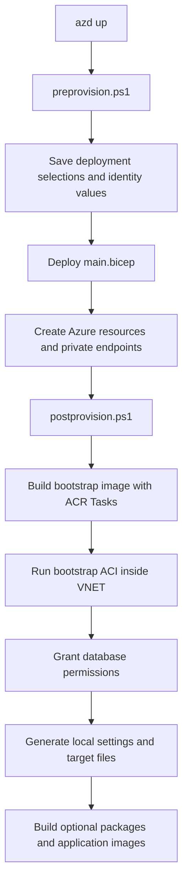

# `azd up` Deployment Lifecycle

This document explains what happens when SQL Build Manager is deployed with:

```powershell
azd up
```

It focuses on the lifecycle hooks, generated local files, managed identities, private database
networking, and the post-provision container used to initialize database permissions.

## Deployment overview

`azure.yaml` configures Azure Developer CLI to:

1. Run `infra/scripts/preprovision.ps1`.
2. Deploy `infra/main.bicep` with `infra/main.parameters.json`.
3. Run `infra/scripts/postprovision.ps1`.



The pre-provision and post-provision hooks run on the machine invoking `azd up`. The database
bootstrap container runs in Azure because SQL Server and PostgreSQL are private-endpoint-only and
cannot be reached directly from a normal developer workstation.

## Phase 1: Pre-provision hook

File: `infra/scripts/preprovision.ps1`

The pre-provision hook prepares the selected azd environment before Bicep parameter expansion.

### Capture the caller's public IP

The script retrieves the caller's public IP from `api.ipify.org` and saves it as:

```text
CURRENT_IP_ADDRESS
```

SQL Server and PostgreSQL no longer use this value because their public network access is disabled.
Other modules can still use it when those services are configured with public network access and
IP-based network rules.

### Capture the deploying identity

The hook reads the signed-in Azure identity and saves:

| azd value | Purpose |
|---|---|
| `AZURE_PRINCIPAL_ID` | Object ID used for RBAC and database administrator restoration |
| `AZURE_PRINCIPAL_NAME` | Login/display name used for database administrator configuration |

These values identify the person running `azd up`. They are not the application's runtime managed
identity.

### Select deployment targets

On the first run for an azd environment, the hook prompts for:

- Azure Batch
- Azure Container Instances
- Azure Container Apps
- Azure Kubernetes Service
- SQL Server
- PostgreSQL

The selections are stored under `.azure/<environment>/.env` as values such as:

```text
DEPLOY_BATCH
DEPLOY_ACI
DEPLOY_CONTAINERAPP
DEPLOY_AKS
DEPLOY_SQLSERVER
DEPLOY_POSTGRESQL
```

Later runs reuse the saved selections. Change them with `azd env set` or by editing the environment
through azd rather than expecting the selection prompt to appear again.

### Force shared build infrastructure

Azure Container Registry is always deployed. It is required by the private bootstrap container even
when no application compute platform was selected.

The hook currently also sets these values to `true` on every run:

```text
BUILD_CONTAINER_IMAGES
GENERATE_MI_SETTINGS
```

Consequently, the runtime/test container images are rebuilt during each `azd up`. Setting these
values to `false` before `azd up` is not persistent because the pre-provision hook writes them back
to `true`.

### Generate the PostgreSQL local administrator password

When PostgreSQL is selected, the hook generates `PG_ADMIN_PASSWORD` if it does not already exist.
The value is saved in the azd environment and passed to Bicep as a secure parameter.

The private bootstrap container does not receive this password. It connects to PostgreSQL with a
managed identity access token.

## Phase 2: Bicep deployment

Entry point: `infra/main.bicep`

The Bicep deployment creates a resource group and composes the resource modules selected by the
pre-provision hook.

### Core resources

The deployment includes:

- A virtual network and dedicated subnets for AKS, Container Apps, ACI, Batch, and private endpoints.
- The SQL Build Manager runtime user-assigned managed identity.
- A separate post-provision user-assigned managed identity.
- Azure Container Registry.
- Storage, Event Hubs, Service Bus, and Log Analytics.
- Selected compute platforms.
- Selected SQL Server and PostgreSQL resources.

### Runtime managed identity

The runtime identity is named:

```text
<prefix>identity
```

It is used by SQL Build Manager workloads running in Batch, AKS, ACI, and Container Apps. Its Azure
RBAC assignments include access to services such as Storage, Service Bus, Event Hubs, ACR, and the
selected compute resources.

Azure RBAC cannot create a contained database user. Database-specific permissions are added later by
the private bootstrap container.

### Post-provision managed identity

The bootstrap identity is named:

```text
<prefix>postprovision
```

It is separate from the runtime identity to avoid permanently granting the application identity
database-administrator privileges.

It receives:

- `Reader` at resource-group scope so it can enumerate the target identities and databases.
- `AcrPull` so ACI can pull the private bootstrap image without registry credentials.

The ACR administrator account is disabled. Image pull uses this managed identity.

### Database networking

SQL Server and PostgreSQL both have:

- Public network access disabled.
- No current-IP firewall rule.
- No "Allow Azure services" firewall rule.
- No SQL service-endpoint virtual network rule.
- A private endpoint for each server.
- A private DNS zone linked to the deployment VNET.

Database traffic must originate from the VNET, a peered network, or a client connected through an
appropriate VPN/private DNS configuration.

The private endpoint subnet is used only for private endpoint network interfaces. The bootstrap
container runs in the separate ACI subnet delegated to
`Microsoft.ContainerInstance/containerGroups`.

### Database administrators

For SQL Server, Bicep initially configures the deploying user as the Microsoft Entra administrator.
SQL Server supports one Microsoft Entra administrator, so the post-provision hook temporarily swaps
this administrator while the bootstrap container runs.

PostgreSQL supports multiple Microsoft Entra administrators. Bicep adds both:

- The deploying user.
- The post-provision managed identity.

This allows PostgreSQL initialization without removing the deploying user's access.

### Outputs returned to azd

Bicep exposes resource names, IDs, subnet IDs, identity IDs, and registry endpoints as outputs. azd
stores these values in the active environment for the post-provision hook. Important outputs include:

```text
ACI_SUBNET_ID
CONTAINER_REGISTRY_NAME
CONTAINER_REGISTRY_LOGIN_SERVER
MANAGED_IDENTITY_NAME
MANAGED_IDENTITY_CLIENT_ID
MANAGED_IDENTITY_PRINCIPAL_ID
POSTPROVISION_IDENTITY_NAME
POSTPROVISION_IDENTITY_ID
POSTPROVISION_IDENTITY_CLIENT_ID
POSTPROVISION_IDENTITY_PRINCIPAL_ID
```

## Phase 3: Post-provision hook

File: `infra/scripts/postprovision.ps1`

The post-provision hook combines operations that must run locally with operations that require VNET
connectivity.

## Private database initialization container

Orchestrator:

```text
scripts/ContainerRegistry/run_private_postprovision_container.ps1
```

Container definition:

```text
infra/postprovision/Dockerfile
infra/postprovision/run-private-postprovision.ps1
```

### Why a container is required

Creating the Azure SQL and PostgreSQL server resources is an ARM control-plane operation. Creating a
database user and granting database roles is a database data-plane operation.

With public access disabled, a local post-provision hook can still call ARM but cannot open a database
connection unless the workstation is connected to the VNET. The bootstrap ACI solves this by running
inside the delegated ACI subnet, where private DNS resolves the database hostnames to their private
endpoint addresses.

### Why the ACI is created by the hook

The bootstrap image does not exist in ACR during the first Bicep deployment. The hook therefore uses
a two-stage process:

1. Bicep creates ACR, the VNET, identities, databases, and role assignments.
2. The post-provision hook builds the image and then creates the ACI.

The ACI is intentionally imperative rather than a Bicep resource. Each `azd up` deletes the previous
container group and recreates it from the newly built image.

### Remote ACR build

The hook creates a minimal temporary build context containing:

- The bootstrap Dockerfile.
- The container entry script.
- SQL Server permission-grant script.
- PostgreSQL permission-grant script.
- Shared resource-name script.

It then runs:

```text
az acr build
```

The build executes remotely through ACR Tasks. Docker does not need to be installed or running on the
developer workstation.

The image is published as:

```text
sqlbuildmanager-postprovision:latest
```

The image contains:

- PowerShell
- Azure CLI
- Microsoft ODBC Driver for SQL Server
- `SqlServer` PowerShell module
- PostgreSQL `psql`
- The private initialization scripts

### Temporary SQL Server administrator swap

Before starting ACI, the local orchestrator:

1. Enumerates the SQL logical servers.
2. Replaces the deploying user with `<prefix>postprovision` as Microsoft Entra administrator.
3. Records each server successfully changed.
4. Waits briefly for the administrator change to propagate.

The swap is a control-plane operation and does not require database network connectivity.

The administrator is changed only long enough for the bootstrap identity to connect and create the
runtime identity's contained database users.

### ACI creation

The hook creates:

```text
<prefix>postprovision
```

with:

- Linux as the explicit container-group operating system.
- The post-provision user-assigned managed identity.
- Identity-based ACR pull.
- The delegated ACI subnet.
- No public database access.
- Restart policy `Never`.
- Deployment flags passed as non-secret environment variables.

ACI creation is retried while new role assignments propagate.

### Container authentication

Inside the container, the entry script runs:

```text
az login --identity --client-id <post-provision-client-id>
```

No client secret, registry password, SQL password, or PostgreSQL password is passed to the container.

### SQL Server initialization

Script:

```text
scripts/Database/grant_identity_permissions.ps1
```

For every non-`master` database on both logical servers, the script:

1. Gets an Azure SQL access token for the post-provision identity.
2. Connects through the SQL private endpoint.
3. Creates a contained external user for `<prefix>identity` if it does not exist.
4. Adds the user to `db_owner`.

The user is created from the runtime identity's client ID with an explicit SQL SID and `TYPE = E`.
This avoids a Microsoft Graph directory lookup and therefore avoids granting Directory Readers to
the SQL logical server.

Connection attempts are retried to allow private DNS and administrator changes to propagate.

### PostgreSQL initialization

Script:

```text
scripts/Database/grant_pg_identity_permissions.ps1
```

For both PostgreSQL servers, the script:

1. Gets an `oss-rdbms` access token for the post-provision identity.
2. Connects with `psql` through the PostgreSQL private endpoint.
3. Maps `<prefix>identity` with `pgaadauth_create_principal_with_oid`.
4. Grants database connection, schema, table, sequence, and default privileges.

The PostgreSQL role uses the runtime identity's object/principal ID and type `service`. Explicit OID
mapping avoids a Microsoft Graph lookup.

### Completion and failure handling

The local hook polls ACI for up to 30 minutes.

On completion it:

1. Prints the container logs.
2. Verifies the container terminated.
3. Requires exit code `0`.

The container group remains deployed in its terminated state for inspection. The next `azd up`
deletes and replaces it.

The SQL administrator restoration runs in a `finally` block whether image deployment, ACI execution,
SQL initialization, or PostgreSQL initialization succeeds or fails. Restoration is retried five
times for every SQL server that was successfully switched.

If restoration cannot be completed, the hook fails and reports the affected server. The bootstrap
identity might remain the SQL administrator and should be corrected with Azure CLI or the portal
before continuing.

## Remaining local post-provision operations

Operations that only use ARM control-plane APIs or write local files remain on the `azd up` machine.
They do not require direct database connectivity.

### AKS initialization

When AKS is selected, the hook:

1. Downloads administrator kubeconfig credentials.
2. Creates the `sqlbuildmanager` namespace.
3. Applies a Kubernetes service account associated with the runtime managed identity through
   workload identity.

The service account is applied declaratively and can be updated on later runs.

### Managed-identity settings files

The hook runs:

```text
scripts/create_all_settingsfiles_mi_only.ps1
```

This generates settings for Batch, AKS, ACI, and Container Apps under:

```text
src/TestConfig
```

Although the log message describes this as optional, the conditional guard is currently commented
out, so settings generation runs on every `azd up`.

### SQL Server target files

The hook runs:

```text
scripts/Database/create_database_override_files.ps1
```

It enumerates servers and databases with Azure Resource Manager commands and writes SQL Server test
target files, tagged targets, invalid-target fixtures, multi-client targets, and `server.txt`.

Listing databases through `az sql db list` is a control-plane operation. It works even when database
public access is disabled.

### PostgreSQL target files

The hook runs:

```text
scripts/Database/create_pg_database_override_files.ps1
```

It uses PostgreSQL ARM commands to enumerate servers and databases and writes PostgreSQL test target
files and `pg-server.txt`.

### Generated local secrets and keys

`scripts/key_file_names.ps1` creates or reuses:

```text
settingsfilekey.txt
un.txt
pw.txt
```

The PostgreSQL target generator can also write:

```text
pg-un.txt
pg-pw.txt
```

These files support local and integration-test configuration. `src/TestConfig` is excluded by
`.gitignore`; do not copy these files into source control or logs.

### Application and test container images

When `BUILD_CONTAINER_IMAGES=true`, the hook remotely builds:

- The SQL Build Manager runtime image, used by Linux Azure Batch container tasks and other compute
  targets.
- The external-test image.
- The dependent-test image.

These are separate from the always-built private bootstrap image.

### Azure Batch container execution

Batch application packages are not used. Azure Batch does not support application packages when its
linked Storage account is protected by firewall rules or private-only networking.

Generated Batch settings reference:

```text
<prefix>containerregistry.azurecr.io/sqlbuildmanager:latest-vNext
```

At execution time SQL Build Manager:

1. Creates a Linux AlmaLinux 8 Gen1 container-enabled Batch pool compatible with the default
   `STANDARD_D1_V2` VM size.
2. Assigns `<prefix>identity` to the pool.
3. Uses that identity's `AcrPull` role to prefetch the runtime image.
4. Runs each task in the image with `/app/sbm`.
5. Mounts the Batch task working directory into the container for input and output files.

Only Linux Batch settings are generated. If an existing pool lacks the requested container
configuration, SQL Build Manager deletes and recreates it because the VM/container configuration is
immutable.

## Identity summary

| Identity | Purpose | Database privilege |
|---|---|---|
| Deploying user | Runs `azd up`, receives RBAC, remains final SQL/PG administrator | SQL/PG administrator |
| `<prefix>identity` | Runtime identity used by SQL Build Manager workloads | `db_owner` in SQL test databases and explicit PostgreSQL grants |
| `<prefix>postprovision` | Runs the private bootstrap ACI | Temporary SQL administrator; additional PostgreSQL administrator |

## Rerunning `azd up`

The deployment is designed to be rerunnable:

- Bicep resource deployment is incremental.
- Database users and role memberships are checked before creation.
- PostgreSQL principal mapping tolerates an existing role.
- The bootstrap image is rebuilt.
- The previous bootstrap ACI is deleted and recreated.
- Generated local configuration files are refreshed.
- The deploying user is restored as SQL administrator after every bootstrap run.

Because the image build flag is reset to `true` by the pre-provision hook, reruns can take
significantly longer than a Bicep-only update.

## Troubleshooting

### Inspect the bootstrap container

```powershell
az container show `
  --resource-group <prefix>-rg `
  --name <prefix>postprovision
```

### Read bootstrap logs

```powershell
az container logs `
  --resource-group <prefix>-rg `
  --name <prefix>postprovision
```

### Inspect recent ACR builds

```powershell
az acr task list-runs `
  --registry <prefix>containerregistry `
  --output table
```

### Confirm SQL administrator restoration

```powershell
az sql server ad-admin list `
  --resource-group <prefix>-rg `
  --server-name <prefix>sql-a
```

Repeat for `<prefix>sql-b`.

### Run only the private initialization orchestration

After Bicep outputs are available in the azd environment:

```powershell
.\scripts\ContainerRegistry\run_private_postprovision_container.ps1 `
  -prefix <prefix> `
  -resourceGroupName <prefix>-rg `
  -repoRoot $PWD `
  -deploySqlServer $true `
  -deployPostgreSQL $true
```

This rebuilds the bootstrap image, recreates ACI, reruns database initialization, and restores the
SQL administrator.

## Key implementation files

| File | Responsibility |
|---|---|
| `azure.yaml` | Registers Bicep and azd lifecycle hooks |
| `infra/scripts/preprovision.ps1` | Captures identity/IP, prompts for services, and prepares azd values |
| `infra/main.bicep` | Subscription-scope deployment orchestrator |
| `infra/modules/network.bicep` | VNET, delegated compute subnets, and private endpoint subnet |
| `infra/modules/database.bicep` | Private SQL Server resources, databases, DNS, and private endpoints |
| `infra/modules/postgresql.bicep` | Private PostgreSQL resources, administrators, DNS, and private endpoints |
| `infra/modules/postprovisionidentity.bicep` | Bootstrap managed identity and RBAC |
| `infra/postprovision/Dockerfile` | Bootstrap container image |
| `infra/postprovision/run-private-postprovision.ps1` | In-container entry point |
| `infra/scripts/postprovision.ps1` | Local post-provision orchestrator |
| `scripts/ContainerRegistry/run_private_postprovision_container.ps1` | ACR build, ACI execution, and SQL administrator restoration |
| `scripts/Database/grant_identity_permissions.ps1` | SQL contained-user creation and role assignment |
| `scripts/Database/grant_pg_identity_permissions.ps1` | PostgreSQL principal mapping and grants |
| `scripts/Database/create_database_override_files.ps1` | Local SQL test target generation |
| `scripts/Database/create_pg_database_override_files.ps1` | Local PostgreSQL test target generation |
