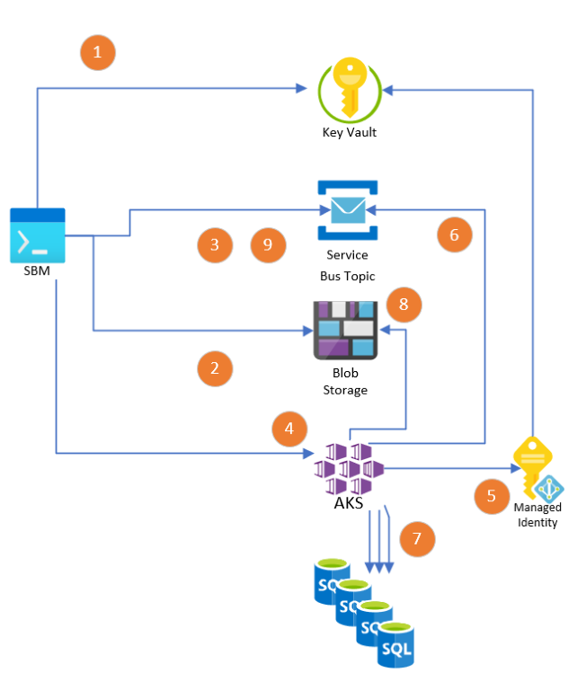

# Key Vault integration for Batch and Kubernetes

The keys, connection strings and passwords can now be stored in Azure Key Vault rather than saving the encrypted values in a settings file or being passed in via the command line. Regardless if you use Batch or Kubernetes, this integration is enabled by leveraging [User Assigned Managed Identities](https://docs.microsoft.com/en-us/azure/active-directory/managed-identities-azure-resources/how-manage-user-assigned-managed-identities). To easily accomplish this setup, there are a set of PowerShell scripts in the [`scripts/templates` folder](../../scripts/templates).

----

## How it works for Batch

0. Start an Azure connection with the [Azure CLI](https://docs.microsoft.com/en-us/cli/azure/install-azure-cli) via `az login`. This will create an authentication token that the `sbm` tooling will use to connect to Key Vault. 
1. Keys, Connection strings and passwords saved in Azure Key Vault with `sbm batch savesettings -kv`. You can also save the secrets to Key Vault in any other fashion you'd like. The secret names are: `StorageAccountKey`, `StorageAccountName`, `EventHubConnectionString`,`ServiceBusTopicConnectionString`, `UserName` (for SQL Server username), `Password` (for SQL Server password), `BatchAccountKey`. This will only need to be done once as long as your secrets do not change.
2. Database targets are sent to Service Bus Topic with `sbm batch enqueue`
3. Batch execution is started with `sbm batch run`. You can pre-stage the worker nodes with `sbm batch prestage`
4. The Batch nodes, leveraging the Managed Identity assigned to them when they were created, accessed the Key Vault and retrieves the secrets
5. The Batch nodes start processing messages from the Service Bus Topic...
6. And update the databases in parallel
7. Once complete, the logs are saved to Blob Storage
8. Status update is sent back to the originating `sbm` command line and processing is complete

----

## How it works for Kubernetes

0. Start an Azure connection with the [Azure CLI](https://docs.microsoft.com/en-us/cli/azure/install-azure-cli) via `az login`. This will create an authentication token that the `sbm` tooling will use to connect to Key Vault. 
1. Keys, Connection strings and passwords saved in Azure Key Vault with `sbm container savesettings -kv`. You can also save the secrets to Key Vault in any other fashion you'd like. The secret names are: `StorageAccountKey`, `StorageAccountName`, `EventHubConnectionString`,`ServiceBusTopicConnectionString`, `UserName` (for SQL Server username), `Password` (for SQL Server password). This will only need to be done once as long as your secrets do not change.
2. The .sbm package file is uploaded to Blob Storage via `sbm container prep`
3. Database targets are sent to Service Bus Topic with `sbm batch enqueue`
4. The containers are started via `kubectl`
   - `kubectl apply -f runtime.yaml` - this sets the runtime settings for the containers (.sbm package name, job name and concurrency settings)
   - `kubectl apply -f secretProviderClass.yaml` - configuration setting up the managed identity
   - `kubectl apply -f podIdentityAndBinding.yaml` - configuration to bind the managed identity to the pods
   - `kubectl apply -f basic_deploy_keyvault.yaml` - deployment to create the pods
5. The pods, leveraging the Managed Identity assigned to them when they were created, accessed the Key Vault and retrieves the secrets
6. The pods start processing messages from the Service Bus Topic...
7. And update the databases in parallel
8. Once complete, the logs are saved to Blob Storage
9. Status update is sent back to the originating `sbm` command line and processing is complete
