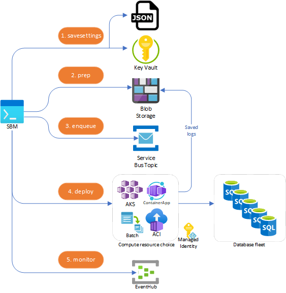

# Massively Parallel Remote Database Builds

If you have a fleet of databases to update, it could take a very long time to run your build on a single machine - even if you leverage the threaded model. To solve this problem, SQL Build Manager offers four ways to parallelize database builds across many compute resources: [Azure Container Apps](containerapp.md), [Azure Batch](azure_batch.md),  [Kubernetes](kubernetes.md) and [Azure Container Instances (ACI)](aci.md).

In each method, compute resources area able to manage concurrency to help you maximize throughput while not overloading your SQL Servers. See [Concurrency Options](concurrency_options.md).

**You can create a demo/sandbox environment to test and play with each method with [Setting up an Azure Environment](setup_azure_environment.md)**

---
## Understanding remote build steps

Each remote build option follows the same basic steps to stage the required configuration and compute resources, then start and monitor the processing. Unless specified, these are sub-commands of each remote option: `sbm k8s|containerapp|batch|aci`

### **savesettings**

Save a settings JSON file for the target compute environment. This step is optional, but is designed for reuse in subsequent commands and across multiple builds targeting the same environment. Each remote type has some variation of options, so use `sbm {remote type} savesettings -h` for specfics. You can also save sensitive information to Azure Key Vault by specifying a `--keyvault` value.

### **run**
Single command used to execute by orchestrating the other commands decribed below. \
_IMPORTANT:_ Currently only available for `sbm k8s` and `sbm containerapp`

### **prep**
(named `prestage` for `sbm batch`) Creates the required Azure Blob storage container and uploads the package file and/or DACPAC so it is accessable to the compute resources. It will also configure any infrastructure templates and for Batch, will spin up the VMs in the node pool. The blob container is specfied by the `--jobname` parameter

### **enqueue**
Remote executions pull their database targets from Azure Service Bus. This step creates a Service Bus Topic Subscription and uses the Override file as its list of targets, creating a message per target.

### **deploy**
(named `run` for `sbm batch`) Deploys the compute infrastucture (for `containerapp` and `aci`) and automatically starts the build once the compute resources are available (`containerapp`, `aci` and `batch`). There is no equivalent step for Kubernetes, for this use the single `k8s run` command or manually run `kubetcl` commands to deploy the pods. 

### **monitor**
By default the `deploy` command automatically flows into and starts monitoring. Monitoring polls the Service Bus Topic for remaining messages and Azure Event Hub for database processing events. A build is considered compelte when the total number of database completion events (commits or errors) is equal to the total number of targets. 

### **cleanup**

An extra command for `sbm batch`. This will deprovision and remove VMs from the batch to ensure you aren't billed for idle resources

---
## Process Flow Details

Start an Azure connection with the [Azure CLI](https://docs.microsoft.com/en-us/cli/azure/install-azure-cli) via `az login`. This will create an authentication token that the `sbm` tooling will use to connect to Key Vault and the other Azure services 
1. `savesettings` - keys, connection strings and passwords saved in Azure Key Vault if `--keyvault` specified, otherwise it will be AES256 encrypted to the JSON file. Non-sensitive information is always saved in the json file 
2. `prep` - The `.sbm` package and DACPAC (if provided) is uploaded to blob storage and resource specific templates are created and readied for deployment
3. `enqueue` - Using the `--override` file as a source, Service Bus Topic messages are enqueued, one for each target database
4. `deploy` (run for batch) - The compute resources are created and immediately start processing messages from the Service Bus topic and performing the build on the targe databases
5. `monitor` - the Service Bus Topic is monitored for remaining messages and EventHub for completion events. Once complets, the compute resource will upload the run logs to the blob storage container 

If using a Managed Identity, the compute resources will leverage this identity vs. connection strings and passwords to access the various resources. See the [Managed Identity documentation](managed_identity.md) to see how each service is able to take advantage of this.