# Threaded Build Process Flow (Mermaid Diagrams)

This document is a companion to [threaded_build_process_flow.md](threaded_build_process_flow.md), with ASCII flow diagrams replaced by Mermaid diagrams that render natively in GitHub and most markdown viewers.

This document describes the internal process flow when executing a database build using the `sbm threaded run` command, starting from `ThreadedManager.ExecuteAsync()`.

## Overview

The threaded build execution allows SQL Build Manager to run scripts against multiple databases concurrently. The process involves several key phases:

1. **Initialization & Validation**
2. **Script Source Configuration**
3. **Build Preparation**
4. **Concurrent Execution**
5. **Script Execution per Database**
6. **Finalization**

---

## High-Level Architecture and Build Process Flow

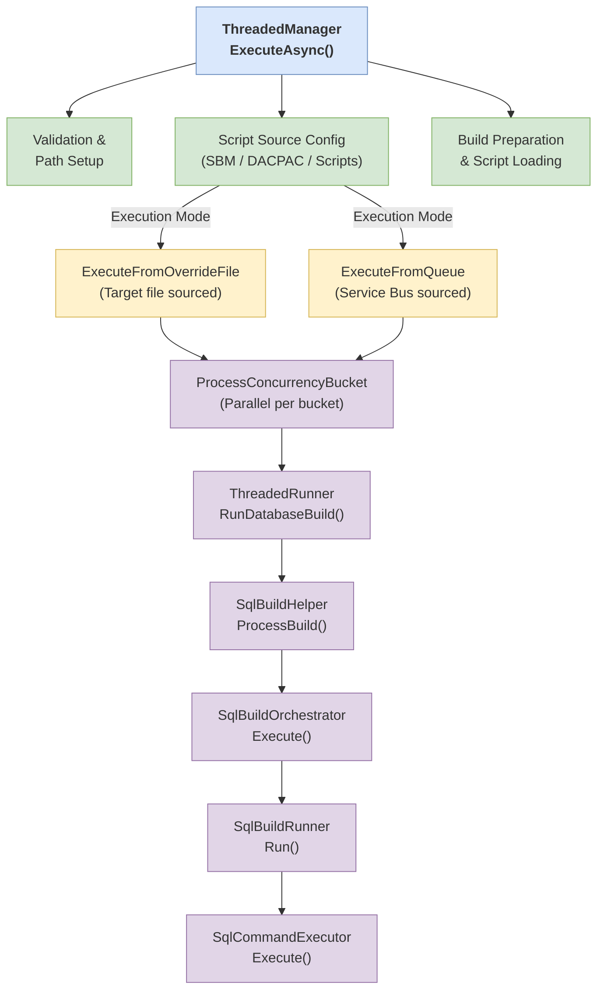

---

## Detailed Process Flow

### Phase 1: Initialization & Validation

**Location:** `ThreadedManager.ExecuteAsync()` (lines 58-87)

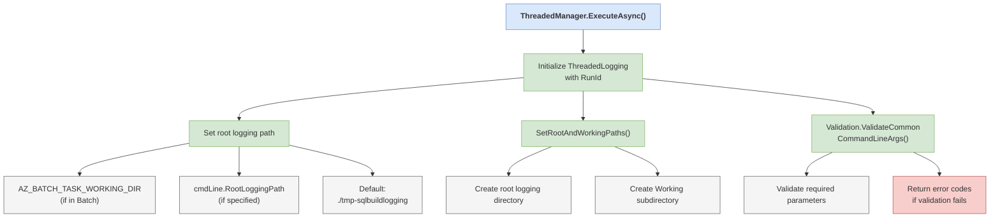

### Phase 2: Script Source Configuration

**Location:** `ThreadedManager.ConfigureScriptSource()` (lines 288-348)

The build can be sourced from multiple inputs. The method determines which source to use:

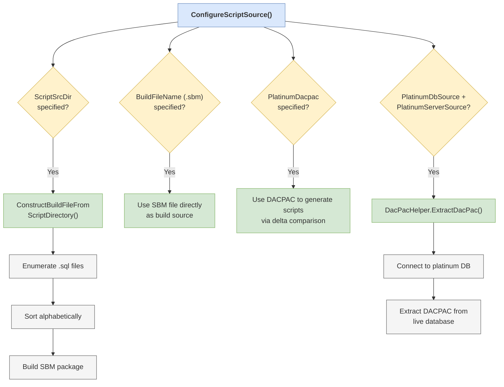

### Phase 3: Build Preparation

**Location:** `ThreadedManager.PrepBuildAndScriptsAsync()` (lines 350-384)

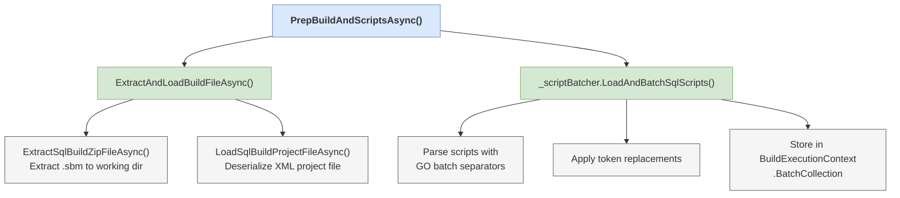

**Key Data Models:**

| Model | Purpose |
|-------|---------|
| `SqlSyncBuildDataModel` | Contains script metadata, execution order, tags |
| `BatchCollection` | Pre-parsed script batches ready for execution |
| `BuildExecutionContext` | Shared state: RunId, paths, batch collection |

### Phase 4: Concurrent Execution

**Location:** `ThreadedManager.ExecuteFromOverrideFileAsync()` (lines 157-217)

Databases are organized into concurrency "buckets" for parallel execution:

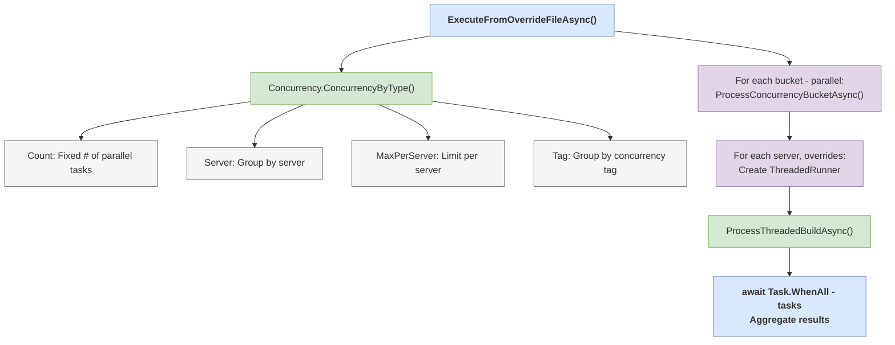

**Alternative: Queue-based Execution**

When using Service Bus (`ExecuteFromQueueAsync()`):

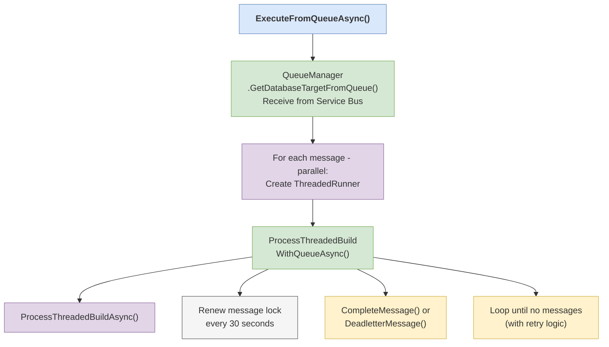

### Phase 5: Script Execution per Database

**Location:** `ThreadedRunner.RunDatabaseBuildAsync()` → `SqlBuildHelper.ProcessBuildAsync()`

This is where scripts are actually executed against each target database:

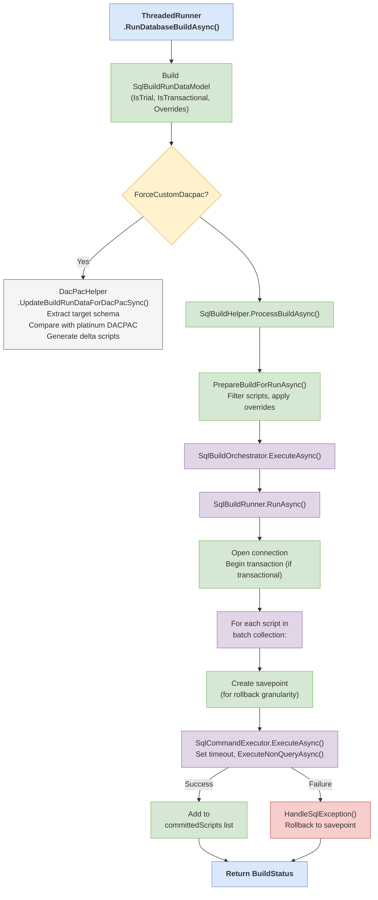

### Phase 6: Transaction Handling & Finalization

**Location:** `SqlBuildRunner` and `DefaultBuildFinalizer`

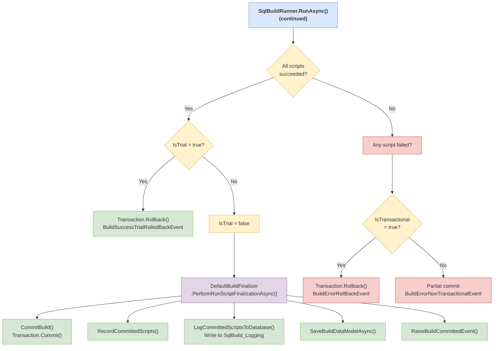

---

## Build Commit and Database Logging

This section details what happens when a build is successfully committed.

### Commit Flow Architecture

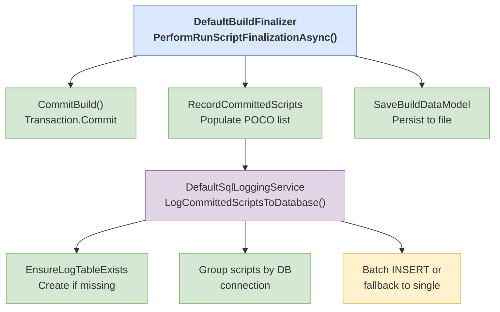

### Detailed Commit Process

**Location:** `DefaultBuildFinalizer.PerformRunScriptFinalizationAsync()`

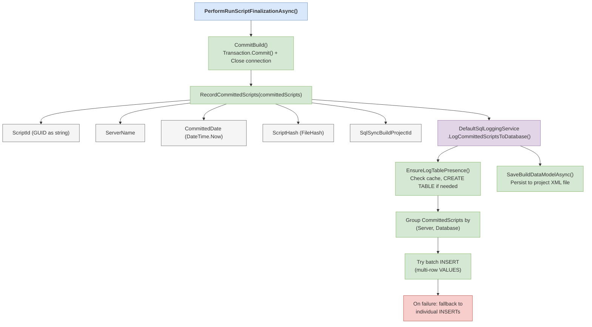

### SqlBuild_Logging Table Schema

The logging table is automatically created in each target database (or alternate logging database if specified):

| Column | Type | Description |
|--------|------|-------------|
| `BuildFileName` | `varchar(300)` | Name of the SBM package file |
| `ScriptFileName` | `varchar(300)` | Name of the SQL script file |
| `ScriptId` | `uniqueidentifier` | Unique ID for the script |
| `ScriptFileHash` | `varchar(100)` | Hash of the script content |
| `CommitDate` | `datetime` | When the script was committed |
| `Sequence` | `int` | Execution order within the build |
| `ScriptText` | `text` | Full text of the SQL script |
| `Tag` | `varchar(200)` | Optional grouping tag |
| `TargetDatabase` | `varchar(200)` | Database the script ran against |
| `RunAs` | `varchar(50)` | User/identity that executed |
| `BuildProjectHash` | `varchar(100)` | Hash of the build project |
| `BuildRequestedBy` | `varchar(200)` | User who initiated the build |
| `ScriptRunStart` | `datetime` | Script execution start time |
| `ScriptRunEnd` | `datetime` | Script execution end time |
| `Description` | `varchar(500)` | Build description |
| `UserId` | `varchar(50)` | User ID |

**Indexes created:**
- `IX_SqlBuild_Logging_BuildFileName` on `BuildFileName`
- `IX_SqlBuild_Logging_CommitDate` on `CommitDate`

### CommittedScript Data Models

Two related models track committed scripts:

**`SqlLogging.CommittedScript`** (Runtime/Transaction object)
Used during execution to track each script as it completes:
- ScriptId (Guid)
- FileHash (string)
- Sequence (int)
- ScriptText (string)
- Tag (string)
- ServerName (string)
- DatabaseTarget (string)
- RunStart (DateTime)
- RunEnd (DateTime)

**`Models.CommittedScript`** (Persistent model)
Stored in SqlSyncBuildDataModel for project history:
- ScriptId (string)
- ServerName (string)
- CommittedDate (DateTime)
- AllowScriptBlock (bool)
- ScriptHash (string)
- SqlSyncBuildProjectId (Guid)

### Logging to Alternate Database

If `--logtodatabasename` is specified, all logging writes go to that database instead of each target database:

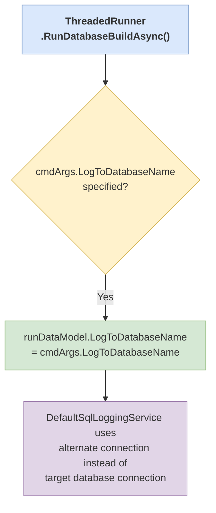

### Error Handling in Logging

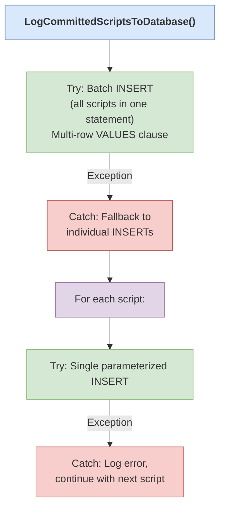

---

## Key Classes Reference

| Class | File | Responsibility |
|-------|------|----------------|
| `ThreadedManager` | `Threaded/ThreadedManager.cs` | Orchestrates entire threaded build |
| `ThreadedRunner` | `Threaded/ThreadedRunner.cs` | Executes build for single server/database set |
| `SqlBuildHelper` | `SqlSync.SqlBuild/SqlBuildHelper.cs` | Entry point for build execution |
| `SqlBuildOrchestrator` | `SqlSync.SqlBuild/SqlBuildOrchestrator.cs` | Handles timeout retries |
| `SqlBuildRunner` | `SqlSync.SqlBuild/SqlBuildRunner.cs` | Iterates through scripts |
| `SqlCommandExecutor` | `SqlSync.SqlBuild/SqlCommandExecutor.cs` | ADO.NET command execution |
| `DefaultBuildFinalizer` | `SqlSync.SqlBuild/Services/DefaultBuildFinalizer.cs` | Commit/rollback transactions, record scripts |
| `DefaultSqlLoggingService` | `SqlSync.SqlBuild/Services/DefaultSqlLoggingService.cs` | Database logging to SqlBuild_Logging table |
| `QueueManager` | `Queue/QueueManager.cs` | Service Bus message handling |
| `Concurrency` | `Threaded/Concurrency.cs` | Concurrency bucket calculation |
| `DacPacHelper` | `DacPac/DacPacHelper.cs` | DACPAC extraction and delta generation |

---

## Return Codes

The build process returns standardized exit codes:

| Code | Enum Value | Description |
|------|------------|-------------|
| 0 | `Successful` | All scripts executed successfully |
| 1 | `FinishingWithErrors` | Some databases had errors |
| 2 | `BuildFileExtractionError` | Could not extract SBM package |
| 3 | `LoadProjectFileError` | Could not load project XML |
| 4 | `NullBuildData` | Build data object is null |
| 5 | `DacpacDatabasesInSync` | DACPAC: target already matches platinum |
| 6 | `RunInitializationError` | Error setting up the run |
| 7 | `ProcessBuildError` | Error during script execution |

---

## Event Flow

Throughout execution, events are raised for monitoring and logging:

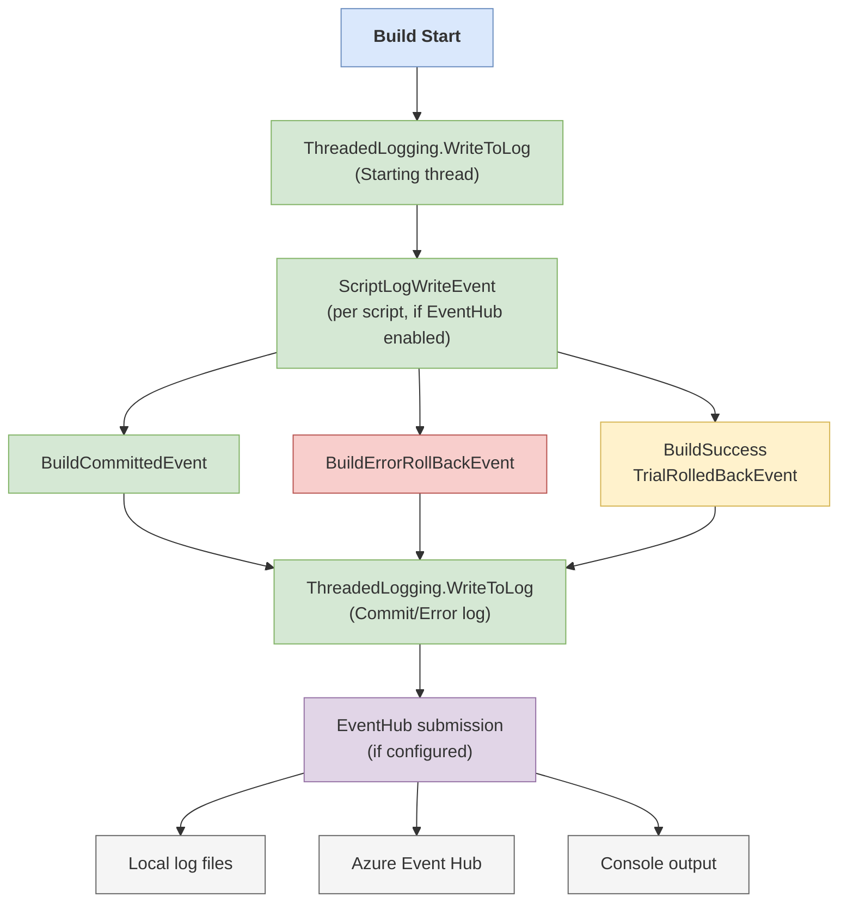

Events can be streamed to:
- Local log files
- Azure Event Hub (for real-time monitoring)
- Console output

---

## Concurrency Model

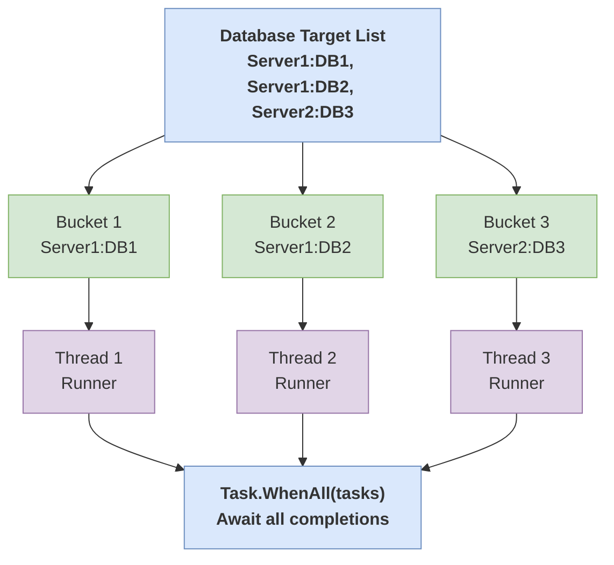

Concurrency is controlled by:
- `--concurrency`: Number of parallel operations
- `--concurrencytype`: How to group databases (Count, Server, MaxPerServer, Tag)

---

## See Also

- [Original ASCII Diagram Version](threaded_build_process_flow.md)
- [Draw.io Visual Diagram Version](threaded_build_process_flow_visual.md)
- [Threaded Build Command Line](threaded_build.md)
- [Concurrency Options](concurrency_options.md)
- [Override Options](override_options.md)
- [Command Line Reference](commandline.md)
