# Threaded Build Process Flow (Visual Diagrams)

This document is a companion to [threaded_build_process_flow.md](threaded_build_process_flow.md), with ASCII flow diagrams replaced by draw.io visual diagrams located in the [diagrams/](diagrams/) folder.

This document describes the internal process flow when executing a database build using the `sbm threaded run` command, starting from `ThreadedManager.ExecuteAsync()`.

## Overview

The threaded build execution allows SQL Build Manager to run scripts against multiple databases concurrently. The process involves several key phases:

1. **Initialization & Validation**
2. **Script Source Configuration**
3. **Build Preparation**
4. **Concurrent Execution**
5. **Script Execution per Database**
6. **Finalization**

---

## High-Level Architecture and Build Process Flow

> **📊 Diagram:** [01_high_level_architecture.drawio](diagrams/01_high_level_architecture.drawio)

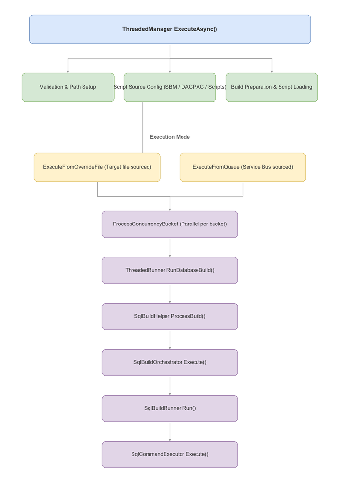

---

## Detailed Process Flow

### Phase 1: Initialization & Validation

**Location:** `ThreadedManager.ExecuteAsync()` (lines 58-87)

> **📊 Diagram:** [02_phase1_initialization.drawio](diagrams/02_phase1_initialization.drawio)

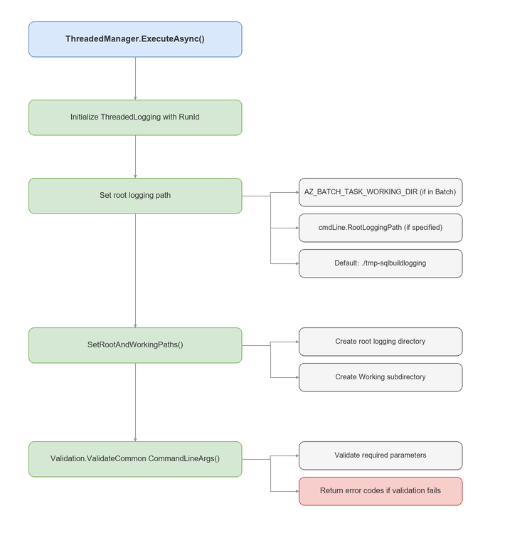

### Phase 2: Script Source Configuration

**Location:** `ThreadedManager.ConfigureScriptSource()` (lines 288-348)

The build can be sourced from multiple inputs. The method determines which source to use:

> **📊 Diagram:** [03_phase2_script_source.drawio](diagrams/03_phase2_script_source.drawio)

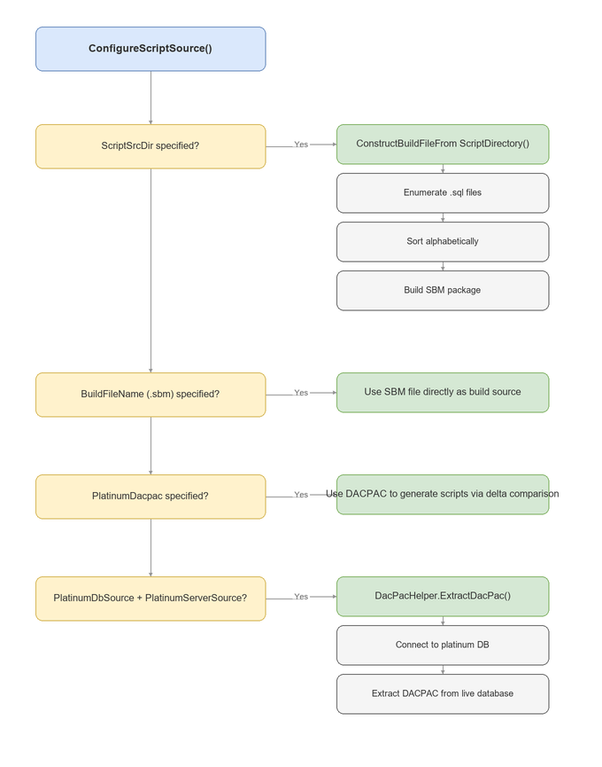

### Phase 3: Build Preparation

**Location:** `ThreadedManager.PrepBuildAndScriptsAsync()` (lines 350-384)

> **📊 Diagram:** [04_phase3_build_preparation.drawio](diagrams/04_phase3_build_preparation.drawio)

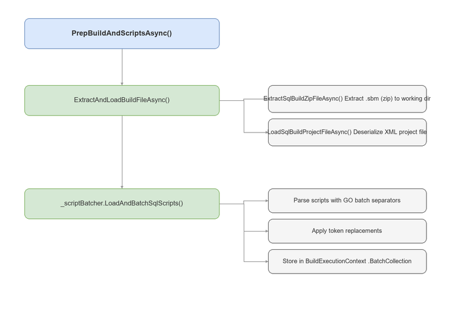

**Key Data Models:**

| Model | Purpose |
|-------|---------|
| `SqlSyncBuildDataModel` | Contains script metadata, execution order, tags |
| `BatchCollection` | Pre-parsed script batches ready for execution |
| `BuildExecutionContext` | Shared state: RunId, paths, batch collection |

### Phase 4: Concurrent Execution

**Location:** `ThreadedManager.ExecuteFromOverrideFileAsync()` (lines 157-217)

Databases are organized into concurrency "buckets" for parallel execution:

> **📊 Diagram:** [05_phase4_concurrent_execution.drawio](diagrams/05_phase4_concurrent_execution.drawio)

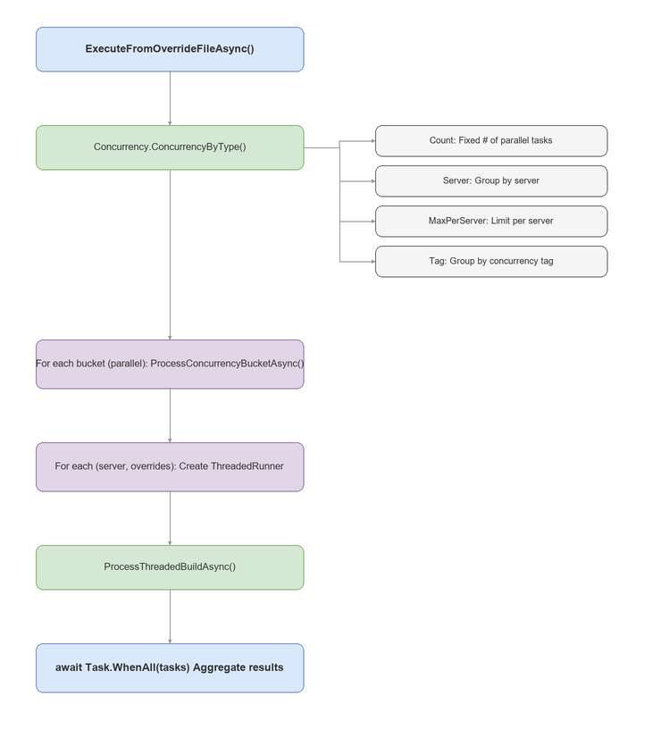

**Alternative: Queue-based Execution**

When using Service Bus (`ExecuteFromQueueAsync()`):

> **📊 Diagram:** [06_phase4b_queue_execution.drawio](diagrams/06_phase4b_queue_execution.drawio)

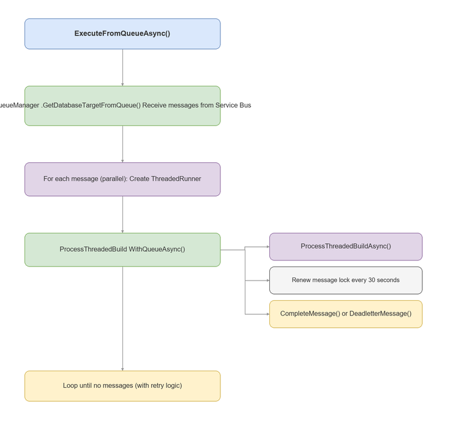

### Phase 5: Script Execution per Database

**Location:** `ThreadedRunner.RunDatabaseBuildAsync()` → `SqlBuildHelper.ProcessBuildAsync()`

This is where scripts are actually executed against each target database:

> **📊 Diagram:** [07_phase5_script_execution.drawio](diagrams/07_phase5_script_execution.drawio)

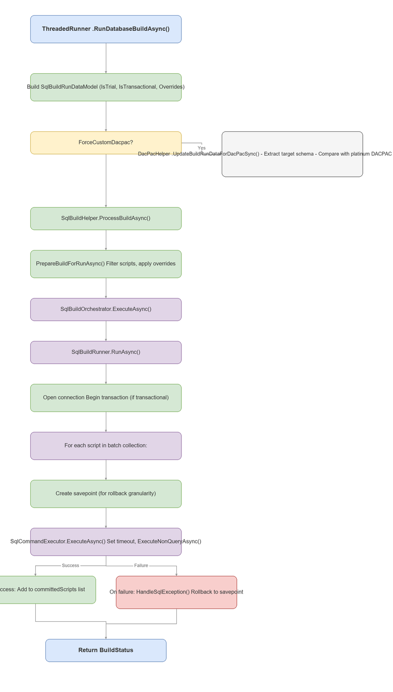

### Phase 6: Transaction Handling & Finalization

**Location:** `SqlBuildRunner` and `DefaultBuildFinalizer`

> **📊 Diagram:** [08_phase6_transaction_handling.drawio](diagrams/08_phase6_transaction_handling.drawio)

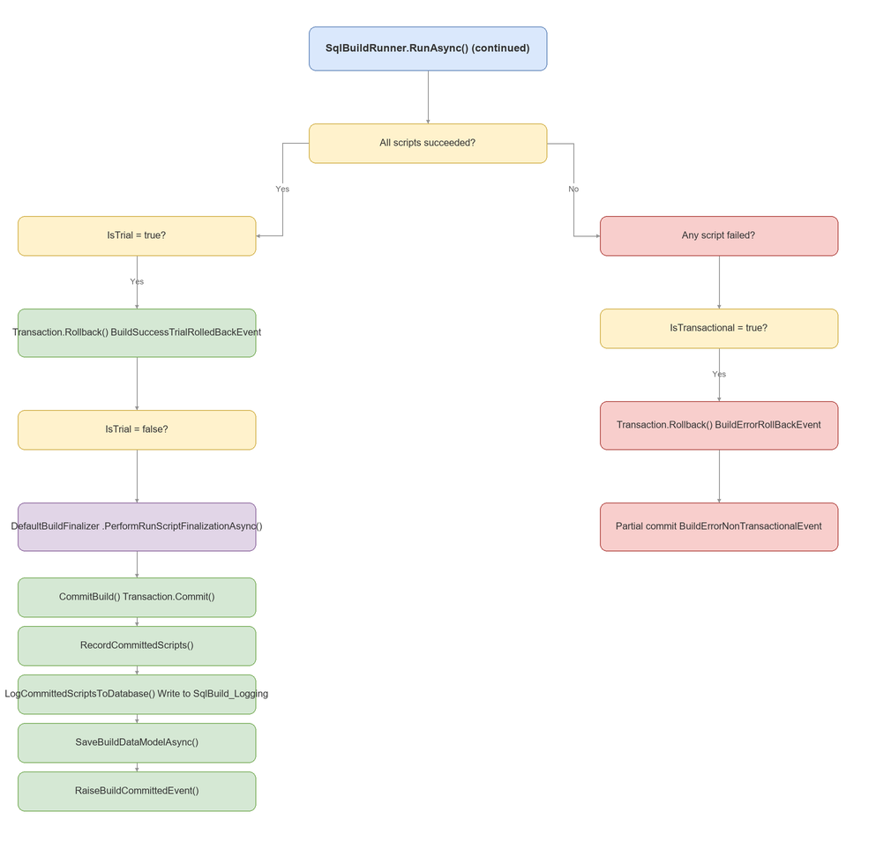

---

## Build Commit and Database Logging

This section details what happens when a build is successfully committed.

### Commit Flow Architecture

> **📊 Diagram:** [09_commit_flow_architecture.drawio](diagrams/09_commit_flow_architecture.drawio)

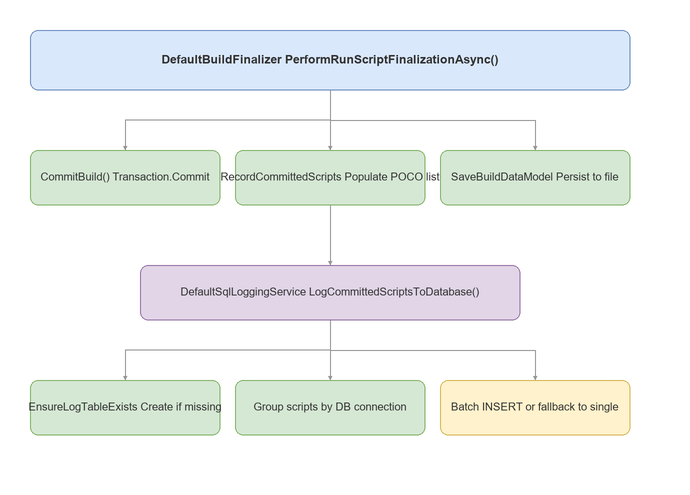

### Detailed Commit Process

**Location:** `DefaultBuildFinalizer.PerformRunScriptFinalizationAsync()`

> **📊 Diagram:** [10_detailed_commit_process.drawio](diagrams/10_detailed_commit_process.drawio)

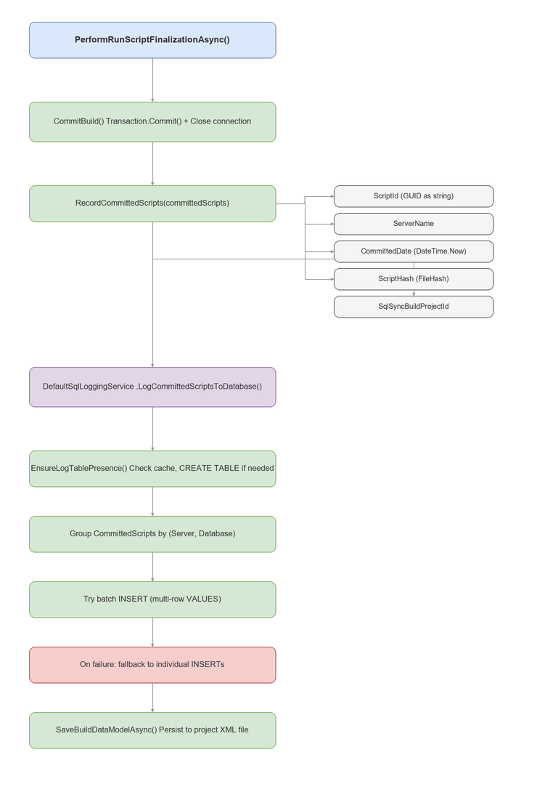

### SqlBuild_Logging Table Schema

The logging table is automatically created in each target database (or alternate logging database if specified):

| Column | Type | Description |
|--------|------|-------------|
| `BuildFileName` | `varchar(300)` | Name of the SBM package file |
| `ScriptFileName` | `varchar(300)` | Name of the SQL script file |
| `ScriptId` | `uniqueidentifier` | Unique ID for the script |
| `ScriptFileHash` | `varchar(100)` | Hash of the script content |
| `CommitDate` | `datetime` | When the script was committed |
| `Sequence` | `int` | Execution order within the build |
| `ScriptText` | `text` | Full text of the SQL script |
| `Tag` | `varchar(200)` | Optional grouping tag |
| `TargetDatabase` | `varchar(200)` | Database the script ran against |
| `RunAs` | `varchar(50)` | User/identity that executed |
| `BuildProjectHash` | `varchar(100)` | Hash of the build project |
| `BuildRequestedBy` | `varchar(200)` | User who initiated the build |
| `ScriptRunStart` | `datetime` | Script execution start time |
| `ScriptRunEnd` | `datetime` | Script execution end time |
| `Description` | `varchar(500)` | Build description |
| `UserId` | `varchar(50)` | User ID |

**Indexes created:**
- `IX_SqlBuild_Logging_BuildFileName` on `BuildFileName`
- `IX_SqlBuild_Logging_CommitDate` on `CommitDate`

### CommittedScript Data Models

Two related models track committed scripts:

**`SqlLogging.CommittedScript`** (Runtime/Transaction object)
Used during execution to track each script as it completes:
- ScriptId (Guid)
- FileHash (string)
- Sequence (int)
- ScriptText (string)
- Tag (string)
- ServerName (string)
- DatabaseTarget (string)
- RunStart (DateTime)
- RunEnd (DateTime)

**`Models.CommittedScript`** (Persistent model)
Stored in SqlSyncBuildDataModel for project history:
- ScriptId (string)
- ServerName (string)
- CommittedDate (DateTime)
- AllowScriptBlock (bool)
- ScriptHash (string)
- SqlSyncBuildProjectId (Guid)

### Logging to Alternate Database

If `--logtodatabasename` is specified, all logging writes go to that database instead of each target database:

> **📊 Diagram:** [14_alternate_database_logging.drawio](diagrams/14_alternate_database_logging.drawio)

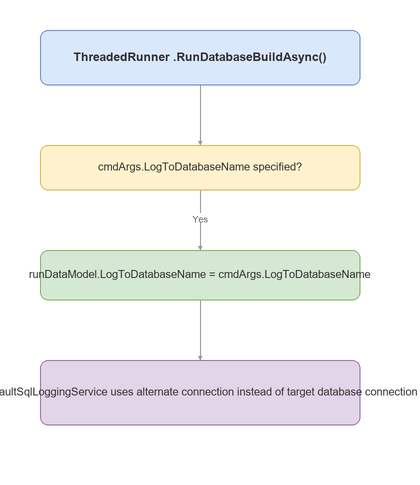

### Error Handling in Logging

> **📊 Diagram:** [11_error_handling_logging.drawio](diagrams/11_error_handling_logging.drawio)

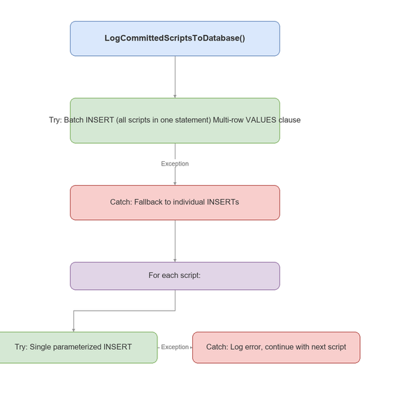

---

## Key Classes Reference

| Class | File | Responsibility |
|-------|------|----------------|
| `ThreadedManager` | `Threaded/ThreadedManager.cs` | Orchestrates entire threaded build |
| `ThreadedRunner` | `Threaded/ThreadedRunner.cs` | Executes build for single server/database set |
| `SqlBuildHelper` | `SqlSync.SqlBuild/SqlBuildHelper.cs` | Entry point for build execution |
| `SqlBuildOrchestrator` | `SqlSync.SqlBuild/SqlBuildOrchestrator.cs` | Handles timeout retries |
| `SqlBuildRunner` | `SqlSync.SqlBuild/SqlBuildRunner.cs` | Iterates through scripts |
| `SqlCommandExecutor` | `SqlSync.SqlBuild/SqlCommandExecutor.cs` | ADO.NET command execution |
| `DefaultBuildFinalizer` | `SqlSync.SqlBuild/Services/DefaultBuildFinalizer.cs` | Commit/rollback transactions, record scripts |
| `DefaultSqlLoggingService` | `SqlSync.SqlBuild/Services/DefaultSqlLoggingService.cs` | Database logging to SqlBuild_Logging table |
| `QueueManager` | `Queue/QueueManager.cs` | Service Bus message handling |
| `Concurrency` | `Threaded/Concurrency.cs` | Concurrency bucket calculation |
| `DacPacHelper` | `DacPac/DacPacHelper.cs` | DACPAC extraction and delta generation |

---

## Return Codes

The build process returns standardized exit codes:

| Code | Enum Value | Description |
|------|------------|-------------|
| 0 | `Successful` | All scripts executed successfully |
| 1 | `FinishingWithErrors` | Some databases had errors |
| 2 | `BuildFileExtractionError` | Could not extract SBM package |
| 3 | `LoadProjectFileError` | Could not load project XML |
| 4 | `NullBuildData` | Build data object is null |
| 5 | `DacpacDatabasesInSync` | DACPAC: target already matches platinum |
| 6 | `RunInitializationError` | Error setting up the run |
| 7 | `ProcessBuildError` | Error during script execution |

---

## Event Flow

Throughout execution, events are raised for monitoring and logging:

> **📊 Diagram:** [12_event_flow.drawio](diagrams/12_event_flow.drawio)

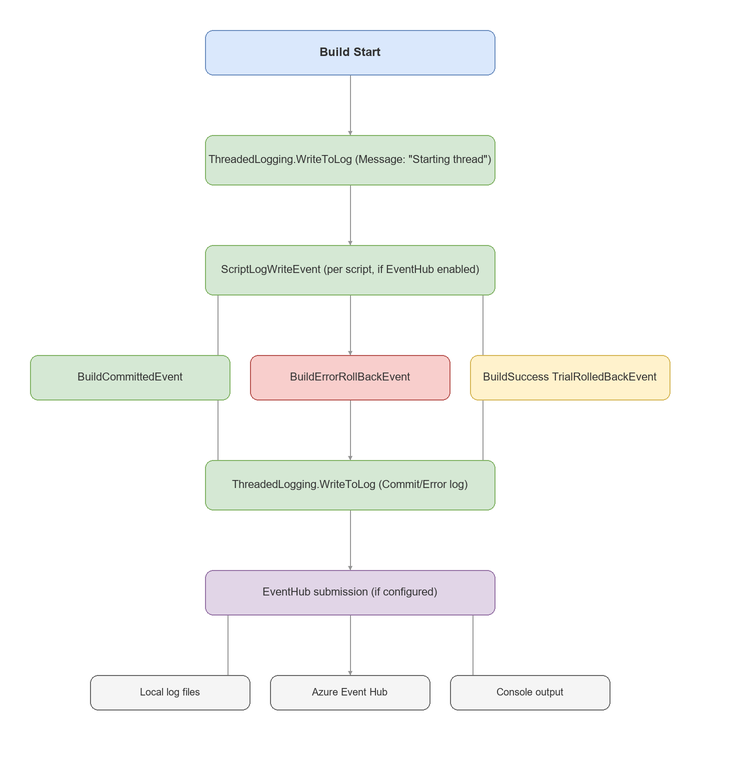

Events can be streamed to:
- Local log files
- Azure Event Hub (for real-time monitoring)
- Console output

---

## Concurrency Model

> **📊 Diagram:** [13_concurrency_model.drawio](diagrams/13_concurrency_model.drawio)

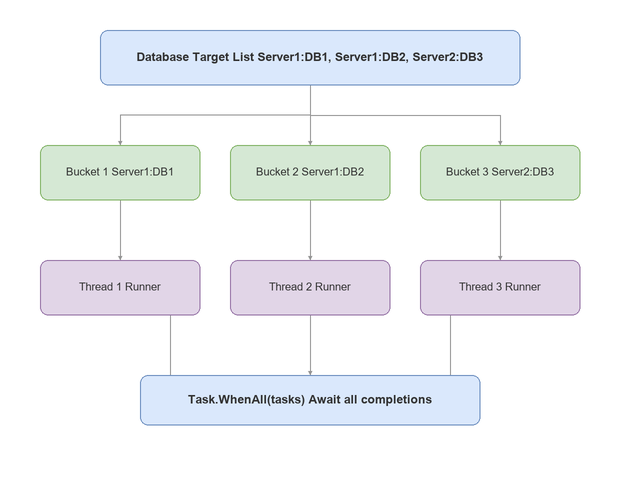

Concurrency is controlled by:
- `--concurrency`: Number of parallel operations
- `--concurrencytype`: How to group databases (Count, Server, MaxPerServer, Tag)

---

## Diagram Index

| # | Diagram | PNG | Editable |
|---|---------|-----|----------|
| 1 | High-Level Architecture | [PNG](diagrams/01_high_level_architecture.png) | [drawio](diagrams/01_high_level_architecture.drawio) |
| 2 | Phase 1 - Initialization | [PNG](diagrams/02_phase1_initialization.png) | [drawio](diagrams/02_phase1_initialization.drawio) |
| 3 | Phase 2 - Script Source Config | [PNG](diagrams/03_phase2_script_source.png) | [drawio](diagrams/03_phase2_script_source.drawio) |
| 4 | Phase 3 - Build Preparation | [PNG](diagrams/04_phase3_build_preparation.png) | [drawio](diagrams/04_phase3_build_preparation.drawio) |
| 5 | Phase 4 - Concurrent Execution | [PNG](diagrams/05_phase4_concurrent_execution.png) | [drawio](diagrams/05_phase4_concurrent_execution.drawio) |
| 6 | Phase 4b - Queue Execution | [PNG](diagrams/06_phase4b_queue_execution.png) | [drawio](diagrams/06_phase4b_queue_execution.drawio) |
| 7 | Phase 5 - Script Execution | [PNG](diagrams/07_phase5_script_execution.png) | [drawio](diagrams/07_phase5_script_execution.drawio) |
| 8 | Phase 6 - Transaction Handling | [PNG](diagrams/08_phase6_transaction_handling.png) | [drawio](diagrams/08_phase6_transaction_handling.drawio) |
| 9 | Commit Flow Architecture | [PNG](diagrams/09_commit_flow_architecture.png) | [drawio](diagrams/09_commit_flow_architecture.drawio) |
| 10 | Detailed Commit Process | [PNG](diagrams/10_detailed_commit_process.png) | [drawio](diagrams/10_detailed_commit_process.drawio) |
| 11 | Error Handling in Logging | [PNG](diagrams/11_error_handling_logging.png) | [drawio](diagrams/11_error_handling_logging.drawio) |
| 12 | Event Flow | [PNG](diagrams/12_event_flow.png) | [drawio](diagrams/12_event_flow.drawio) |
| 13 | Concurrency Model | [PNG](diagrams/13_concurrency_model.png) | [drawio](diagrams/13_concurrency_model.drawio) |
| 14 | Alternate Database Logging | [PNG](diagrams/14_alternate_database_logging.png) | [drawio](diagrams/14_alternate_database_logging.drawio) |

---

## See Also

- [Original ASCII Diagram Version](threaded_build_process_flow.md)
- [Threaded Build Command Line](threaded_build.md)
- [Concurrency Options](concurrency_options.md)
- [Override Options](override_options.md)
- [Command Line Reference](commandline.md)
